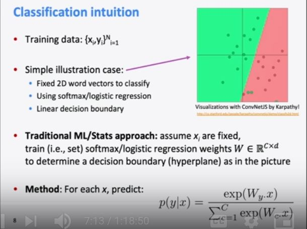

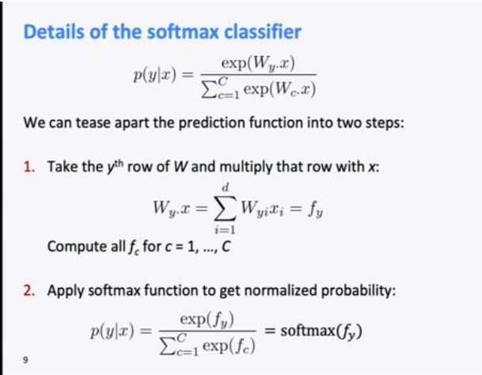

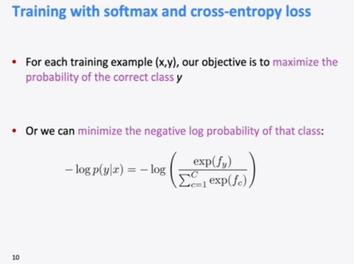

Probability of true class or p(c) is 1 and then we get the softmax loss.

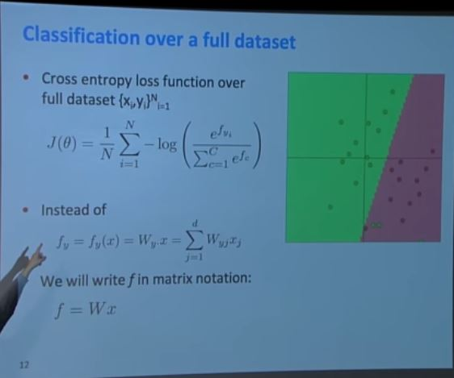

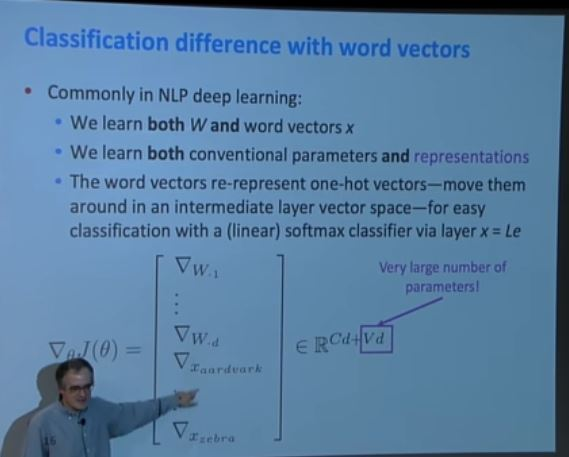

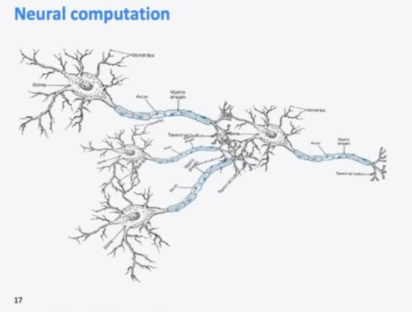

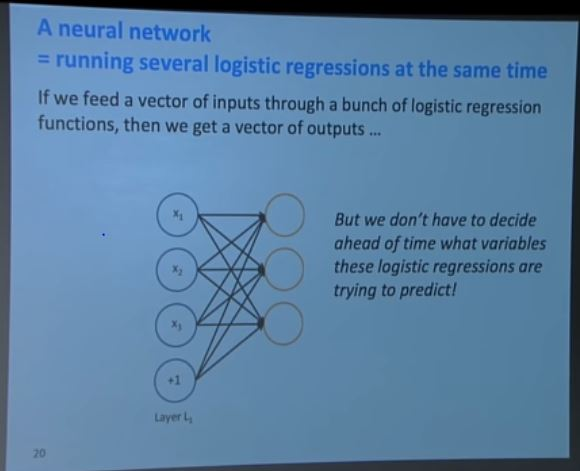

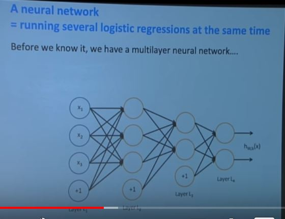

We can do classification for more complex task if we have deeper network.

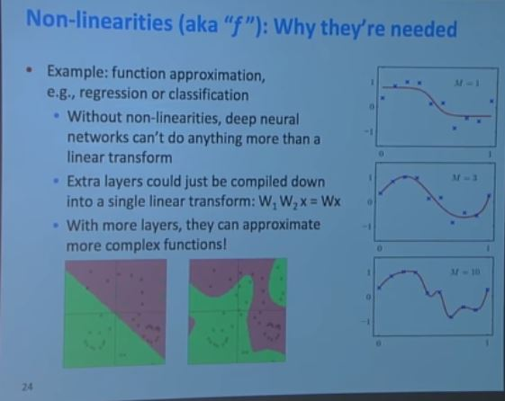

Our general picture is well, we want to be able to do effective function approximation or curve fitting. We'd like to learn a space like this and we can only do that if we're sort of putting in some non-linearities which allow us to learn these kind of curvy decision, um, patterns. And so- so F is used effectively for doing accurate fu- function approximation or sort of pattern matching as you go along. 

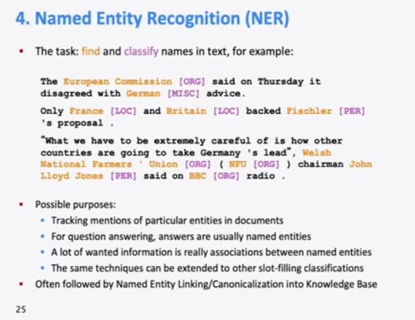

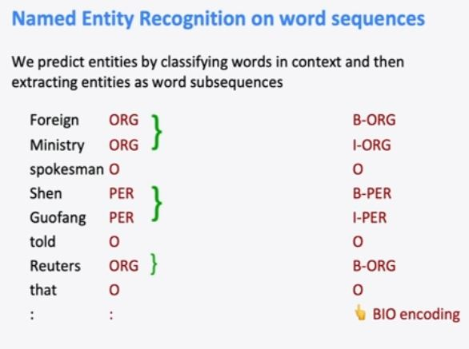

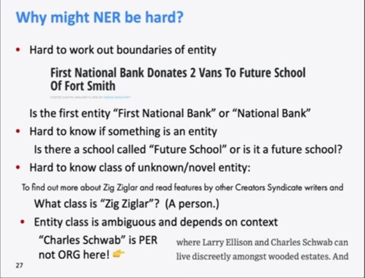

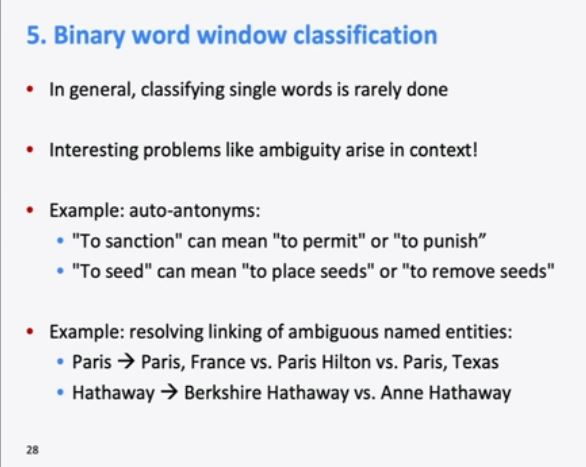

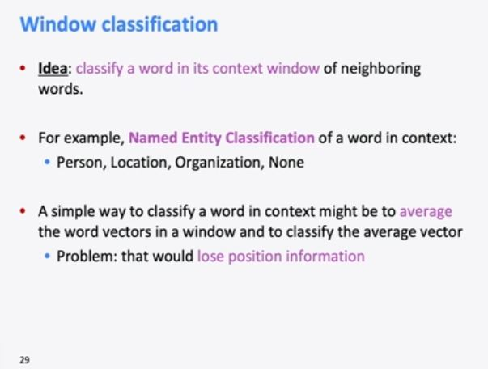

Problem - we don't really know which of these words are meant to be classified.

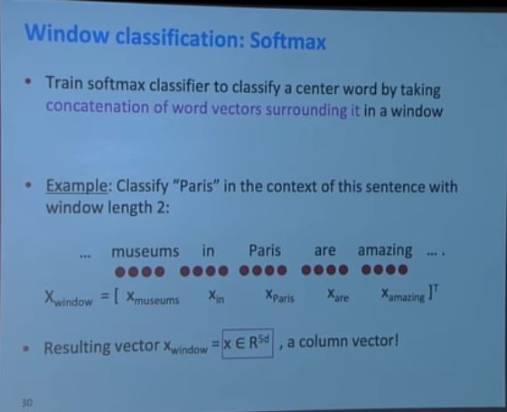

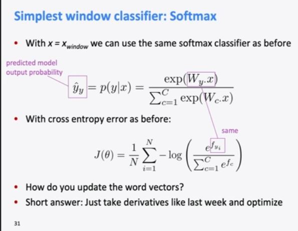

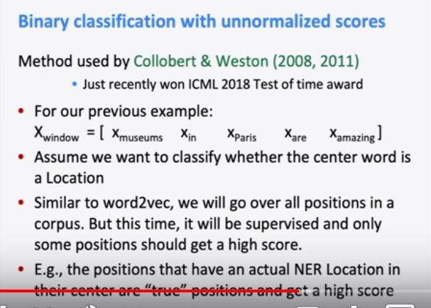

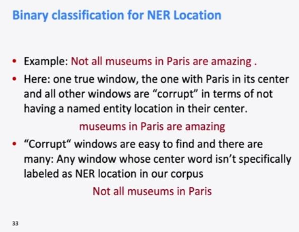

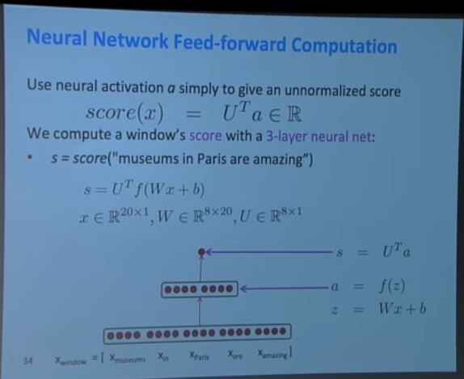

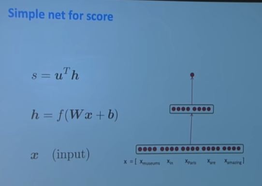

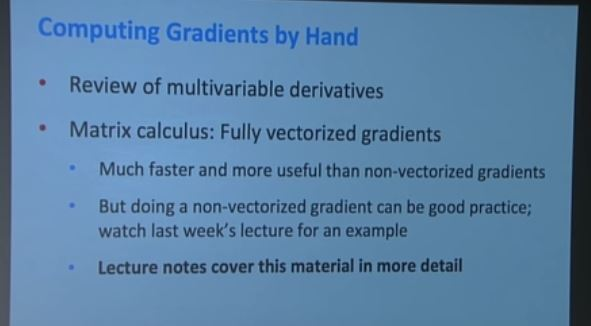

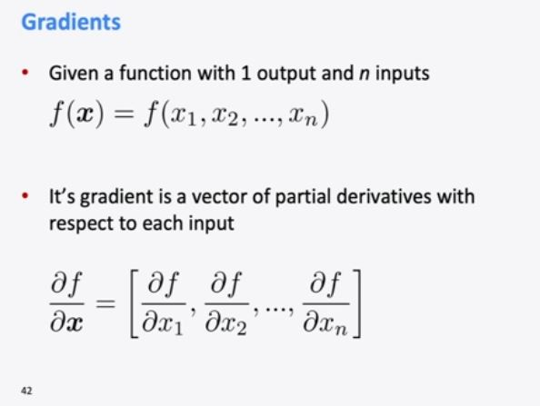

So in the Jacobian, um, you're sort of taking these partial derivatives, um, with respect to each, um, output along the rows and with respect to each input down the columns. And so you're getting these m by n partial derivatives, considering every combination of an output and an input. 

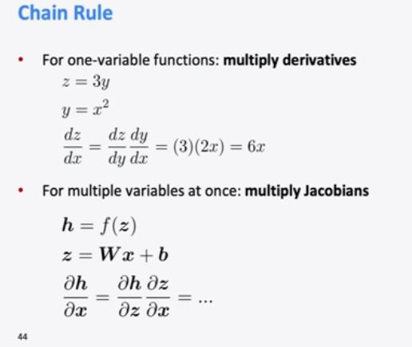

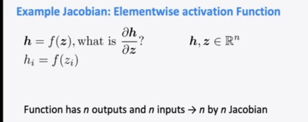

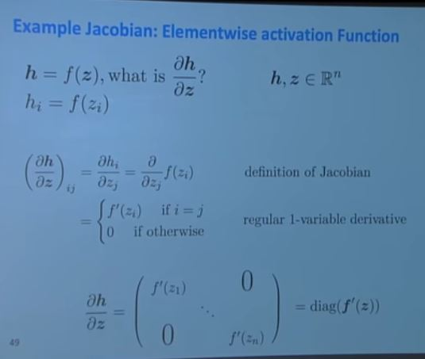

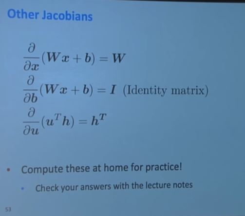

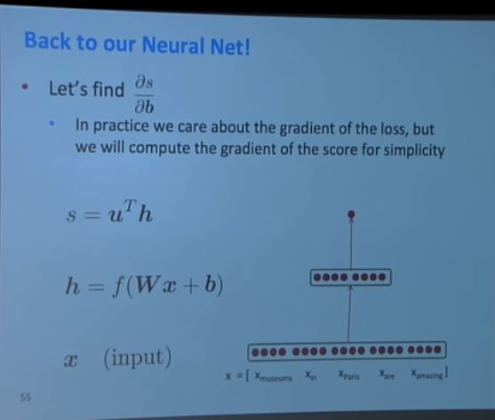

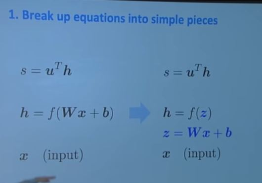

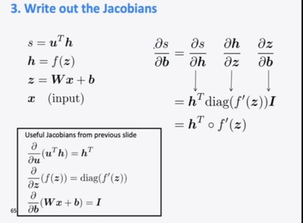

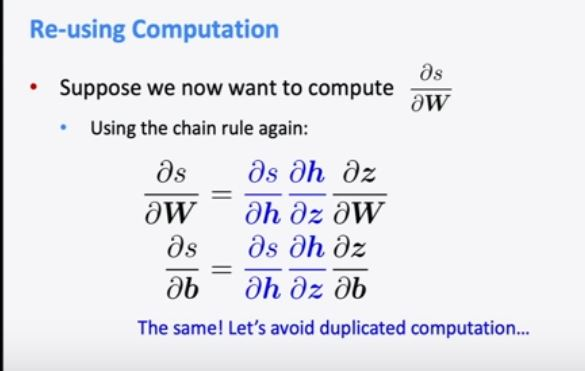

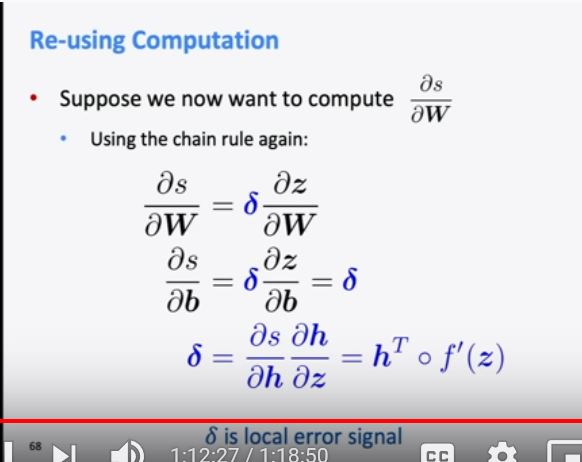

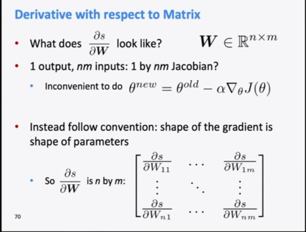

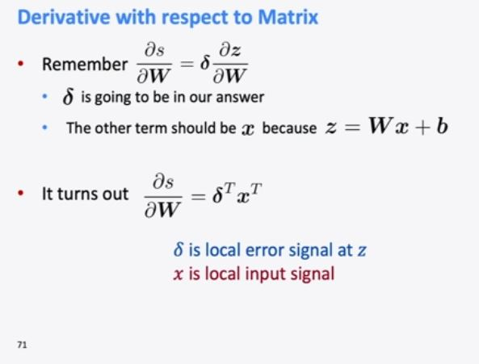

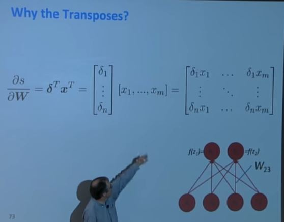

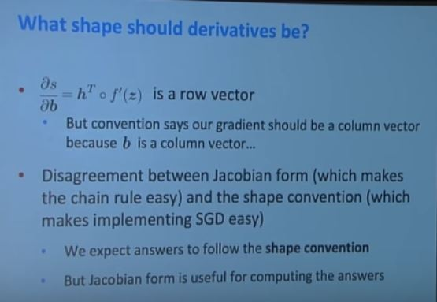