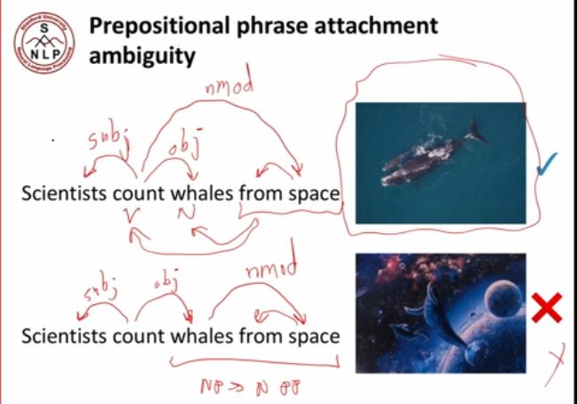
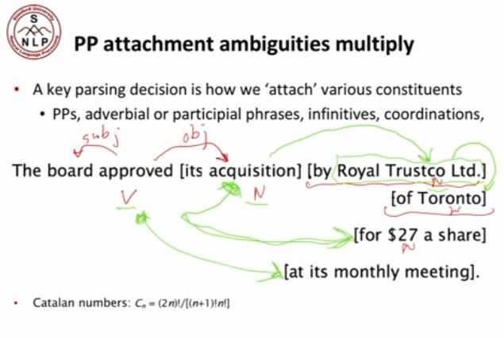
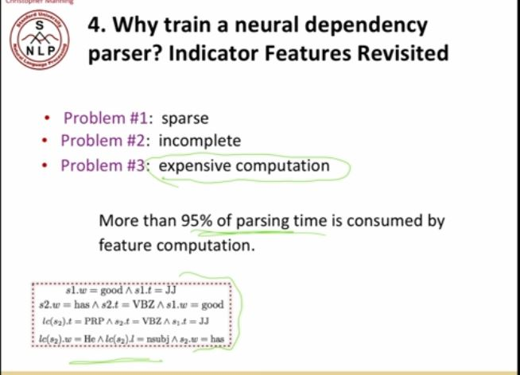

But to represent the structure, what we're going to say is, "Well, look here is the the root of this whole sentence." So, that's where things start. Um, and then, well, where are we going to look is in the large crate, so that is a dependent of look. And well, if we- then we have for the crate, it's got some modifies its a large crate. So, that's a dependent of crate. Its the large crate, that's a dependence of crate. And in this system of dependencies I'm going to show you, we've got in as kind of, um, a modifier of crate in the large crate. I could come back to that. Well, but this crate has its own modification, because it's a crate in the kitchen. So, we have, in the kitchen, as a modifier of crate. And it's the kitchen in the kitchen, these are dependence of crate. And well, then we have this next bit by the door. And as I'll discuss in a minute, well, what does the by the door modifying? It's still modifying the crate, it saying, ''It's the crate by the door.'' Okay. So, the by the door is also a dependent of crate, and then we've got the structure of dependencies coming off of it. 

what we're doing is saying, what, what words modify other words? And so, that allows us to sort of understand how the different parts of the sentence relate to each other. 

So, what are the two meanings. Meaning one. The cop stabs the guy. [LAUGHTER] The cop stabs the guy. Right. So, meaning one is the cop stabs that guy. So, what we've got here is, we've got the cops that are killing. So, this is what we'll say is the subject of kill, is the cops, and I'll just call them the San Jose cops here. And well, there's what they kill which say that, the man is an object of killing. Um, and then while one person is the, the cop using knife to kill the person. And so that's then that this is, um, modifier and here if we complex we call it an instrumental modifier to say that the cops are killing people with a knife. That's one possible analysis. Okay. Then, there's a second meaning sentence can have. The second meaning sentence can have. [NOISE] Okay. The second meaning the sentence can have is, that's the man has a knife. So, um, in that case, what we wanna say is, well, you know, is this word man, and this man has, uh, noun modifier, um, which is sort of saying something that the man possesses, and then this dependency is the same, and it's a man with a knife. Okay. And so, the interpretations of these sentences that you can get depend on putting different structures over the sentences in terms of who is- what is modifying what? 

So again, this sentence has two possible structures, right? [LAUGHTER] That we have, the scientists are the subject that are counting and the whales are the object. Um, and, well, one possibility is that this is how they're doing the counting, um, so that they're counting the whales from space using something like a satellite. Um, but the other possibility is that these parts are the same, this is the subject, and this is the object, but these are whales from space which, you know, we could have analyzed as a noun phrase goes to, um, and now, on a PP, you know, um, constituency grammar, but its dependency grammar we saying, "Oh, this is now a modifier of the whales, and that they are whales from space, um, that are starting to turn up as in the bottom example." Right? So, obviously what you want is this one is correct and this one is here wrong. Um, and so this choice is referred to as a prepositional phrase attachment ambiguity, and it's one of the most common ambiguities in the parsing of English, right? So, here's our prepositional phrase from space. And so in general, when you have prepositional phrases and before it you have verbs, and noun phrases, or nouns, that the prepositional phrase can modify either of the things that come beforehand, right? 

Human languages are, um, this prepositional phrase can go with anything proceeding, and the hearer is assumed to be smart enough to work out the right one. 

We need to develop AI such that they can interpret well the language.

Um, okay. So, this is prepositional phrase attachment. It's sort of seems maybe not that hard there, but you know, it, it gets worse, I mean, this isn't as fun an example, but it's a real example of a sentence from The Wall Street Journal actually. The board approved this acquisition by Royal Trustco Limited of Toronto for $0.27, $27 a share at its monthly meeting. Boring sentence, but, um, what is the structure of this sentence? Well, you know, we've got a verb here, and we've got exactly the same subject, and for this noun, um, object coming after it. But then what happens after that? Well, here, we've got a prepositional phrase. Here, we've got a prepositional phrase. You've just got a see four prepositional phrases in a row. And so, well, what we wanna do is say for each of these prepositional phrases what they modify, and starting off there only two choices, the verb and the noun proceeding as before. But it's gonna get more complicated as we go in, because look, there's another noun here, and another noun here, and another noun here. Um, so once we start getting further in there'll be more possibilities. Okay. So, let's see if we can, um, work it out. So, um, by Royal Trustco Limited, what's that modifying? [NOISE] Right. You see acquisition, so it's not the board approved by Royal Trustco Limited, it's an acquisition by Royal Trustco Limited. Okay. So, this one is a dependent of the acquisition. Okay. Um, now, we went to of Toronto, and we have three choices, that could be this, this, or this. Okay. So, of Toronto is modifying. Acquisition. [NOISE] Its acquisition of Toronto? [LAUGHTER] No, I think that's a wrong answer. Um. [LAUGHTER] Is there another guess for what of Toronto is modifying? Royal Trustco. Royal Trustco, right. So, it's Royal Trustco Limited of Toronto. So, this of Toronto is a dependent of Royal Trustco Limited. And Royal Trustco Limited, right, that's this again, sort of this noun phrase, so it can also have modifiers by prepositional phrase. Okay. For $27 a share is modifying acquisition, right? [NOISE] So now, we leap right back. [NOISE] I'm drawing this wrong. Now, we leap right back and, um, is now the acquisition that's being modified. And then finally, we have at its monthly meeting is modifying? [NOISE] Approved. Well, the approved, right? It's approved, yeah. It's approved that its monthly meeting. 

if I wanna put an analysis ac- on to this sentence I've to work out the, the right structure, I have to potentially consider an exponential number of possible structures because, I've got this situation where for the first prepositional phrase, there were two places that could have modified. 
For the second prepositional phrase, there are three places that could have modified. For the fourth one, there are five places that could have modified. That just sounds like a factorial. It's not quite as bad as the factorial, because normally, once you've let back that kind of closes off the ones in the middle. And so, further prepositional phrases have to be at least as far back in terms of what they modify. 
And so, if you get into this sort of combinatorics stuff the number of analyses you get when you get multiple prepositional phrases is the sequence called the Catalan numbers. 
Ah, but that's still an exponential series. 

So, yeah there are two possibilities, right? That is either that there's somebody who's a shuttle veteran and a long time NASA executive, and their name is Fred Gregory, and that they've been appointed to the board. Um, or, um, the other possibility is that there's a shuttle veteran and there's a long time NASA executive, Fred Gregory, and both of them have been appointed to the board. And so, again, we can start to indicate the structure of that using our dependency. So, we can ether, um, say, okay, um, there's Fred Gregory and then this person is, um, a shuttle veteran and long ta- and whoops, and longtime NASA executive. Or we can say, well, we're doing appointment of a veteran and the longtime NASA executive, Fred Gregory. And so, we can represent by dependencies, um, these two different structures. 

But effectively in, um, a natural language or certainly English, um, you can use kind of just comma of sort of list intonation to effectively act as if it was an "And" or an "Or", right? So, here, um, we have again two possibilities that either we have issues and the dep- and the dependencies of- the dependencies of issues is that there are no issues. So, that's actually a determiner, ah, no issues. Um, and then it's sort of like no heart or cognitive issues. So, heart is another dependent. It's sort of a non-compound heart issues. And so, we refer to that as an independency, and then it's heart or, um, cognitive. Um, so that heart or cognitive is a conjoined phrase inside of this "No heart" or "Cognitive issues". But there's another possibility, um, which is, um, that the coordination is at the top level that we have "No heart" and "Cognitive issues". And, um, at that point, we ha- have the "Cognitive" as an adjective modifier of the "Issues" and the "No heart", the determiner is just a modifier of "Heart", and then these being conjoined together. So, um, "Heart" has a depend- has a coordinated dependency of "Issues". 

So, what the person [LAUGHTER] who wrote this intended to have is that there- we- Here we've got an adjective modifier ambiguity. So, the intended reading was, um, that "First" is an adjectival modifier of "First hand" and it's firsthand experience. Um, so, the "First hand" is a modifier of "Experience" and the "Job" is also a modifier of "Experience". And then we have the same kind of subject, object, um, reading on that one. Um, but unfortunately, um, this sentence, um, has a different reading, um, where you change the modification relationships. 

We've got this big phrase that I want to try and put a structure of to be used for Olympic beach volleyball, um, and then, you know, this is sort of like a prepositional phrase attachment ambiguity but this time instead of it's a prepositional phrase that's being attached, we've now got this big verb phrase we call it, right, so that when you've sort of got most of a sentence but without any subject to it, that's sort of a verb phrase to be used for Olympic beach volleyball which might be then infinitive form. Sometimes it's in part of CPO form like being used for beach volleyball. And really, those kind of verb phrases they sort of just like, um, prepositional phrases. Whenever they appear towards the right end of sentences, they can modify various things like verbs or nouns. Um, so, here, um, we have two possibilities. So, this to be used for Olympics beach volleyball. Um, what the right answer is meant to be is that that is a dependent of the Rio beach. So, it's a, um, modifier of the Rio Beach. Um, but the funny reading is, um, that instead of that, um, we can have here is another noun phrase muti- mutilated body, um, and it's the mutilated body that's going to be used. Um, and so then this would be, uh, a noun phrase modifier [NOISE] of that. 

what we're doing for this class, we're never gonna make use of these labels. All we're doing is making use of the arrows. And for the arrows, you should be able to interpret things like prepositional phrases as to what they're modifying just in terms of where the prepositional phrases are connected and whether that's right or wrong.

Um, and the idea of tree banks is to say we are going to get human beings to sit around and [NOISE] put grammatical structures over sentences. So, here are some examples I'm showing you from Universal Dependencies where here are some um, English sentences. I think Miramar was a famous goat trainer or something. And some human being has sat and put a dependency structure over this sentence and all the rest. Um, and with the name Universal Dependencies, this is just an aside. Um, Universal Dependencies is actually project I've been strongly involved with. But precisely what the goal of universal dependencies was is to say what we'd like to do is have a uniform parallel system of dependency description which could be used for any human language. So, if you go to the Universal Dependencies website, it's not only about English. You can find Universal Dependency analyses of you know, French, or German, or Finish, or Carsac, or Indonesian, um, lots of languages. Of course, there are um, even more languages which there aren't Universal Dependencies analyses of. So, if you have a- a big calling to say I'm gonna build a Swahili Universal Dependencies um, treebank, um, you can get in touch. 

Discussion of issues. That's a reasonable thing. So, it's reasonable to have issues as dependent of discussion um, where you know, discussion of outstanding. That sounds weird. So, you probably don't want that dependency. Um, there's a question of how far apart words are. Most dependencies are fairly short distance. They not all of them are. There's a question of what's in between. Um, if there's a semicolon in between, there probably is an a dependency across that. Um, and the other issue is sort of how many arguments do things take? So, here we have was completed. If you see the words was completed, you sort of expect that there'll be a subject before of the something was completed, and it would be wrong if there wasn't. So, you're expecting an argument on that side. But on the other side, hand it won't have object after it. You won't say the discussion was completed the goat. Um, that's not a good sentence, right? So, you won't have ah, um, an object after it. So, there's sort of information of that sort, and we want to have our dependency parsers be able to make use of that structure. 

Um, so effectively what we do when we build a dependency parser is going to say, for each word is- is going to be the dependent of some other word or the root. So, this give here is actually the head of the sentence. So, it's a dependent of root, the talk is a dependent of give, 'll is a dependent of talk. And so, for each word we want to choose what is the dependent of and we want to do it in such a way that the dependencies form a tree. So that means it would be a bad idea if we made a cycle. So, if we sort of said, Bootstrapping, um, was a dependent of, um, talk, um, but then we had things sort of move around. So,this goes to here, but then talk is a dependent that, and so I'm gonna cycle that's bad news, we don't want cycles, we want a tree. And there's one final issue, um, which is we don't want things that, um, is whether we want to allow dependencies to cross or not, um, and this is an example of this. So, most of the time, um, dependencies don't cross each other. Uh, but sometimes they do, and this example here is actually an instance for that. So, I'll give a talk tomorrow, um, on bootstrapping. So, we're giving a talk that's the object, and when it's being given is tomorrow, but this talk has a modifier that's on bootstrapping. So, we actually have another dependency here that crosses, um, that dependency. And that's sort of rare, that doesn't happen a ton in English, but it happens sometimes in some structures like that. And so, this is the question of whether, um, what we say is that the positive sentence is projective if there no crossing dependencies and it's non-projective if there are crossing dependencies, and most of the time, English's projective and it's parses of sentences, but occasionally not. And when it's not is when you kind of have these constituents that are delayed to the end of the sentence, right? You could've said, I'll give a talk on bootstrapping tomorrow, and then a [inaudible] have a projective parse, but if you want to, you can kind of delay that extra modifier and say I'll give a talk tomorrow on bootstrapping and then the parse becomes non-projective. 

So, what I wanna to do is parse the sentence "I ate fish". And yet formally what I have is I have a why I start, there are three actions I can take and I have a finished condition for formal parse, parse. Um, and so here's what I do. So, I have a stack which is on this side and I have a buffer. Um, so, the stack is what I have built, and the buffer is all the words in the sentence I haven't dealt with yet. So, I stop the parse, and that's the sort of instruction here, by putting route, my root for my whole sentence onto my stack, and my buffer is the whole sentence, and I haven't found any dependencies yet. Okay, and so then, the actions I can take is to shift things onto the stack or to do the equivalent of a Reduce where I build dependencies. So, starting off, um, I can't build a dependency because I only have root on the stack, so the only thing I can do is shift, so I can shift I onto the stack. Um, now, I could at this point say, let's build a dependency, I is a dependent of root, but that would be the wrong analysis, because really the head of this sentence is I ate. So, I'm a clever boy and I shift again. And now I have root I ate on the stack. Okay, and so, at this point, I'm in a position where, hey, what I'm gonna do is reductions that build structure, because look, I have I ate here and I want to be able to say that I is the subject of dependency of ate, and I will do that by, um, by doing a reduction. And so, what I'm gonna do is the left-arc reduction, which says, look, I'm gonna treat the second from top thing on the stack as a dependent of the thing that's on top of the stack. And so, I do that, and so, when I do that, I create the second from the head thing as a subject dependent of ate, and I leave the head on the stack ate, but I sort of add this dependencies as other dependencies I've built. Okay, um, so, I do that. Um, now, I could immediately reduce again and say ate is a dependent of root, but my sentence's actually I ate fish. So, what I want to do is say, "Oh, if it's still fish on the buffer," so what I should first do is shift again, have root ate fish in my sentence, and then I'll be able to say, Look, I want to now build, um, the thing on the top of this stack as a right dependent of the thing that's second from top of the stack, and so that's referred to as a Right-Arc move, and so, I say Right Arc, and so, I do a reduction where I've generated a new dependency and I take the two things that are on top of the stack and say, um, fish is a dependent of ate, and so therefore, I just keep the head. I always just keep the hit on the stack and the- and I generate this new Arc. And so, at this point, I'm in the same position I want to say that this ate is a right dependent of my route, and so, I'm again going to do Right Arc, um, and make this extra dependency here. Okay. So, then my finished condition of having successfully parsed the sentence is my buffer is empty and I just have root left on my stack because that's what I sort of said back here, that was, buffer is empty as my finished condition. Okay. So, I've parsed the sentence. 

I actually had different choices of when to pa- when to shift and when to reduce. And I just miraculously made the right choice at each point. And well, one thing you could do at this point is say, well, you could have explored every choice and, um, seen what happened and gone different parsers. And I could have, but if that's what I'd done, I would've explored this exponential size tree of different possible parsers. And if that was what I was doing, I wouldn't be able to parse efficiently. 

In 60s,70s and 80s -> dynamic programming

Um, so, what I could do instead, is say I'm at a particular position in the parse and I'm gonna build a machine learning classifier and that machine learning classifier is gonna tell me the next thing to do. It's gonna tell me whether to shift, um, with left arc or right arc. So, if we're only just so talking about, well, how to build the arrows, they're just three actions, shift, left arc or right arc. Um, if we also wanted to put labels on the dependencies, and we have our different labels, um, there are then sort of 2R plus actions because she is sort of left arc subject or left arc object or something like that. But anyway, there's a set of actions and so you gonna build a classifier with machine learning somehow which will predict the right action and Joakim Nivre showed the sort of slightly surprising fact that actually you could predict the correct action to take with high accuracy. So, um, in the simplest version of this, um, there's absolutely no search. You just run a classifier at each step and it says "What you should do next is shift" and you shift, and then it says "What you should do is left arc" and you left arc and you run that through and he proved, no, he showed empirically, that even doing that, you could parse sentences with high accuracy. Now if you wanna do some searching around, you can do a bit better, but it's not necessary. Um, and we're not gonna do it for our, um, assignment. But so if you're doing this just sort of run classify, predict action, run classify, predict action, we then get this wonderful result which you're meant to explain a bit honest on your assignment 3, is that what we've built is a linear time parser. Right? That because we are gonna be sort of- as we chug through a sentence, where we're only doing a linear amount of work for each word and that was sort of an enormous breakthrough. Because although people in the 60s hadn't come up with these dynamic programming algorithms, dynamic programming algorithms for sentences were always cubic or worse. And that's not very good if you want to parse the whole web, whereas if you have something that's linear time, that's really getting you places. 

Okay. So this is the conventional way in which this was done. Was, you know, we have a stack, we might have already built some structure if we hadn't working out something's dependent of something. We have a buffer of words that we don't deal with and we want to predict the next action. So the conventional way to do this is to say well, we want to have features. And well, the kind of features you wanted was so the usually some kind of conjunction or multiple things so that if the top word of the stack is good, um, and something else is true, right, that the second top word of the stack it has, and it's part of speech is verb, then maybe that's an indicator of do some action. So ha- had these very complex binary indicator features and you'd build- you literally have millions of these binary indicator features and you'd feed them into some big logistic regression or support vector machine or something like that and you would build parses. And these parses worked pretty well. Um, but you sort of had these sort of very complex hand engineered binary features. 

So, what you do is well, you assume because the human wrote it down, that there is a correct dependency parse for a sentence. She saw the video lecture like this. And so these are the correct arcs and to evaluate our dependency parser, we're simply gonna say, uh, which arcs are correct. So, there are the gold arcs, so there's a gold arc, um, from two to one, She saw subject, and there's a gold arc from zero to two, the root of the sentence, these the gold arcs. Um, if we generate a parse, we're gonna propose some arcs as to what is the head of each word. And we're simply going to count up how many of them are correct, treating each arc individually. And there are two ways we can do that. We can either, as we're going to do, ignore the labels and that's then, uh, referred to as the unlabeled attachment score. So here in my example, my dependency paths, I've got most of the arcs right but it got this one wrong. So I say my unlabeled attachment score is 80 percent or we can also look at the labels and then my parser wasn't very good at getting the labels rights, so I'm only getting 40 percent. And so we can just count up the number of dependencies and how many we get correct. 

So I'd mentioned to you already that the conventional model, uh, had these sort of indicated features of, um, on the top of the stack is the word good and the second thing on the stack is the verb has or on the top of the stack is some other word and the second top is of some part of speech. And that part of speech has already been joined with the dependency of another part of speech. People hand-engineer these features. And the problems with that, was these features were very sparse. Each of these features matches very few things. Um, they match some configurations but not others so the features tend to be incomplete. Um, and there are a lot of them, they're are commonly millions of features. And so it turned out that actually computing these features was just expensive so that you had some configuration on your stack and the buffer and then you wanted to know which of these features were active for that stack and buffer configuration. And so you had to compute features format. And it turned out that conventional dependency parsers spent most of their time computing features, then went into the machine learning model rather than doing the sort of shifting and, which you're are seeing, are just a pure parser operation. And so that seemed like it left open the possibility that, well, what if we could get rid of all of this stuff and we could run a neural network directly on the stack and buffer configuration, then maybe that would allow us to build a dependency parser which was faster and suffer less from issues of sparseness than the conventional dependency parser. 

And so the secret was we're gonna make use of distributed representations like we've already seen for words. So for each word, we're going to represent it as a word embedding, like we've all what already seen. And in particular, um, we are gonna make use of word vectors and use them as the represent- the starting representations of words in our Parser. But well, if we're interested in distributed representations, it seem to us like maybe you should only have distributed representations of words. Um, maybe it also be good temp distributed representations of other things. So we had parts of speech like, you know, nouns and verbs and adjectives and so on. Well some of those parts of speech have more to do with each other than others. I mean, [NOISE] in particular, um, most NLP work uses fine-grained parts of speech. So you don't only have a part of speech like noun or verb, you have parts of speech like singular noun versus plural noun and you have different parts of speech for, you know, work, works, working, kind of the different forms of verbs are given different parts of speech, um, as well. So there's sort of sets of parts of speech labels that kind of clusters. So maybe we could have distributed representations, a part of speech that represent their similarity. Why not? Um, well if we're gonna do that, why not just keep on going and say the dependency labels. They also, um, have a distributed representation. And so, we built a representation that did that. So the idea is that we have in our stack, the sort of the top positions of the stack, the first positions of the buffer and for each of those positions, we have a word and a part of speech and if we've already built structure as here, we kind of know about a dependency that's already been built. And so we've got a triple for each position and we're gonna convert all of those into a distributed representation, um, which we are learning and we're gonna use those distributed representations, um, to build our parser. 

But for this model, um, we did it in a sort of a very simple straightforward way. We said, well, we could just use exactly the same model, exactly the same parser structure that Nivre used, right? Doing those shifts and left arcs and right arcs. Um, the only part we're gonna turn into a neural network is we're gonna have the decision of what to do next, um, being controlled by our neural network. So our neural network is just a very simple classifier of the kind that we are talking about last week. So based on the configuration, we create an input layer which means we're sort of taking the stuff in these boxers and turn- and looking up a vector representation for each one and concatenating them together to produce a input representation that's sort of similar to when we were making those window classifiers and then we can concatenate a bunch of stuff together. So that gives us in our input layer. [NOISE] Um, so from there, we put things through a hidden layer just like last week. We do Wx plus b and then put it through a ReLU or a non-linearity to a hidden layer. And then on top of that, we're simply gonna stick a softmax output layer. So multiplying by another matrix, adding another, um, bias term, and then that goes into the softmax which is gonna give a probability over our actions as to whether it's shift left arc or right arc, or the corresponding one with labels. And then we're gonna use the same kind of cross entropy loss to say how good a job did we do at guessing the action that we should have taken according to the tree bank parse of the sentence. And so each step of the shift-reduce parser, we're making a decision as what to do next and we're doing it by this classifier and we're getting a loss to the extent that we don't give probability one to the right action. Um, and so that's what we did using the tree bank. We trained up our parser, um, and it was then able to predict the sentences. And the cool thing- the cool thing was, um, that this, um, had all the good things of Nivre's parser but, you know, by having it use these dense representations, it meant that we could get greater accuracy and speed than Nivre's parser at the same time. So here is sort of some results on that. I mean, I already showed you some earlier results, right? So this was showing, um, the fact, um, that, you know, we're outperforming these earlier parsers basically. But subsequent to us doing this work, um, people at Google, um, these papers here by Weiss and Andor, um, they said, "Well, this is pretty cool. Um, maybe we can get the numbers even better if we make our neural network, um, bigger and deeper and we spend a lot more time tuning our hyper-parameters." Um, sad but true. All of these things help when you're building neural networks and when you're doing your final project. Sometimes the answer to making the results better is to make it bigger, deeper and spend more time choosing the hyper-parameters. Um, they put in Beam search as I sort of mentioned. Um, Beam search can really help. So in Beam search, you know, rather than just saying, "Let's work out what's the best next action, do that one and repeat over", you allow yourself to do a little bit of search. You sort of say, "Well, let's consider two actions and explore what happens.