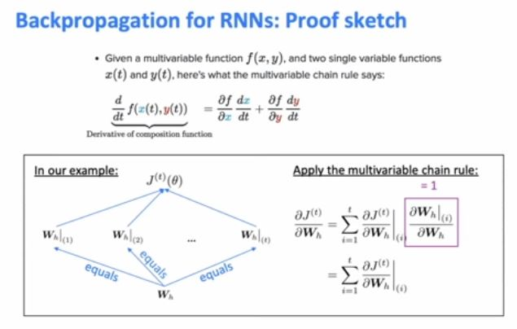
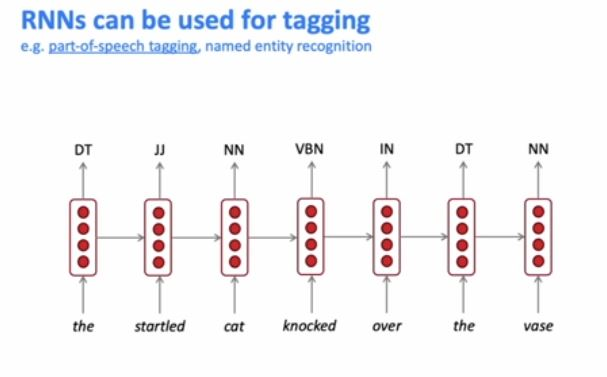

So, the question I want to raise now is, was it a good idea for us to discard the proctor context? If you look at the actual example that we had, the example was as the proctor started the clock, the students opened their blank. So, do we think that books or exams is more likely given the actual context, the full context? Yep. Exams. Right. Exams is more likely because the proctor and the clock heavily implies that it's an exam scenario, so they're more likely to be opening the exams than the books, unless it's an open book exam. Uh, but I think, overall, it should be exams. So, the problem that we're seeing here is that in the training corpus, the fact that students were opening something means that it's more likely to be books than exams because overall, books are more common than exams. But if we know that the context is, the proctor and the clock, then it should be exams. So, what I'm highlighting here is a problem with our simplifying assumption. If we throw away too much context, then we are not as good as predicting the words as we would be if we kept the context. 

Uh, there are some other problems as well. So, uh, here again is the equation that you saw before. One problem which we're gonna call the sparsity problem is what happens if the number on top, the numerator, what if that count is equal to zero. So, what if for some particular word W, the phrase students opened their W never occurred in the data. So, for example, let's suppose students opened their petri dishes, is fairly uncommon and it never appears in the data, then that means our probability of the next word being petri dishes will be zero. And this is bad, because it might be uncommon but it is, a valid scenario, right? 

So, this is a problem and we call it the sparsity problem, because the problem is that if we'd never seen an event happen in the training data, then our model assigns zero probability to that event. 

So, one partial solution to this problem is that maybe we should add a small delta, small number delta to the count, for every word in the vocabulary. And then this way, every possible word that come next, has at least some small probability. 

So, petri dishes will have some small probability, but then so, will all of the other words which are possibly bad choices. So, this, uh, technique is called smoothing, because the idea is, you're going from a very, uh, sparse probability distribution, which is zero, almost everywhere, with a few spikes where there's, uh, being n-grams that we've seen, it goes from that to being a more smooth probability distribution where everything has at least a small probability on it. 

So, the second sparsity problem which is possibly worse than the first one is, what happens if the number in the denominator is zero? So, in our example, that would mean, what if we never even saw the trigram "students opened their" in the training data. If that happens, then we can't even calculate this probability distribution at all for any word W because we never even saw this context before. So, a possible solution to this is that if you can't find "students open their" in the corpus, then you should back off to just conditioning on the last two words, rather than the last three words. So, now you'd be looking at times when you'd seen, uh, "open their" and seeing what what's come next. So, this is called back-off because in this failure case, for when you have no data for your 4-gram language model, you're backing off to a trigram language model. 

Increasing n increases sparsity problem

How does it [inaudible] [NOISE] So the question is, how does the n-gram Language Model know when to put commas. Uh, so you can, [NOISE] decide that commas and other punctuation are just another kind of word, is that well or token, and then, to the Language Model it doesn't really make much difference. It's just used that as another possible world that can be, um, predicted, that's why we've got the weird spacing around the, the commas is because it was essentially viewed as a separate word. 

So in that scenario you take some kind of window around the word that you care about which in this example is Paris, and then, uh, you get the word embeddings for those, concatenate them put them through some layers, and then you get your decision which is that Paris is a location not, you know, a person or organization. 
 

Here's an example of a fixed-window neural language model. So, again, we have some kind of context which is, as the proctor started the clock the students opened their, um, we're trying to guess what word might come next. So we have to make a similar simplifying assumption to before. Uh, because it's a fixed size window, uh, we have to discard the context except for the window that we're conditioning on. So let's suppose that our fixed window is of size four. So what we'll do is similarly to the, ah, NER model. We're going to represent these words with one-hot vectors, and then we'll use those to look up the word embeddings for these words using the, uh, embedding lookup matrix. So then we get all of our word embeddings E,1, 2, 3, 4, and then we concatenate them together to get e. We put this through a linear layer and a nonlinearity function f to get some kind of hidden layer, and then we put it through another linear layer and the softmax function and now we have an output probability distribution y hat. And in our case because we're trying to predict what word comes next, ah, ah, vector y hat will be of length v where v is the vocabulary and it will contain the probabilities of all the different words in the vocabulary. So here I've represented that as a bar charts where if you suppose you've got all of the words listed alphabetically from a to z, and then there's the different probabilities of the words. So if everything goes well, then this language model should tell us that some likely next words are books and laptops, for example. So none of this should be, um, unfamiliar to you because you saw it all last week. We're just applying a Window-based model to a different task, such as language modeling. Okay, so what are, some good things about this model compared to n-gram language models? So one, ah, advantage I'd say is that there's no sparsity problem. If you remember an n-gram language model has a sparsity problem which is that if you've never seen a particular n-gram in training then, you can't assign any probability to it. You don't have any data on it. Whereas at least here you can take any, you know, for example, 4-gram you want and you can feed it into the, ah, the neural nets and it will give you an output distribution of what it thinks the next word would be. It might not be a good prediction but at least it will, it will run. Another advantage is you don't need to store all of the observed n-grams that you ever saw. So, uh, this an advantage by, uh, comparison you just have to store all of the word vectors for all the words in your vocabulary. Uh, but there are quite a lot of problems with this fixed-window language model. So here are some remaining problems: Uh, one is that your fixed window is probably too small. No matter how big you make your fixed window, uh, you're probably going to be losing some kind of useful context that you would want to use sometimes. And in fact, if you try to enlarge the window size, then you also have to enlarge the size of your, uh, weight factor, sorry, your weight matrix W. Uh, so the width of W because you're multiplying it by e which is the concatenation of your word embeddings. The width of W grows as you increase the size of your window. So in inclusion really your window can never be large enough. Another problem with this model which is more of a subtle point is that X1 and X2 and really all of the words in the window they're, uh, multiplied by completely diffe rent weights in W. So to demonstrate this you could draw a picture. So the problem is that if you have your weight matrix W and then you have your concatenation of embeddings e and we have, uh, four embeddings. So we have e_1, e_2, e_3, e_4, and you multiply, uh, the concatenated embeddings by the weight matrix. So really you can see that there are essentially kind of four sections of the weight matrix, and the first word embedding e_1 is only ever multiplied by the weights for it in this section, and that's completely separate to the weights that multiply by e_2 and so forth. So the problem with this is that what you learn in the weight matrix in one section is not shared with the others. You're kind of learning a lot of similar functions four times. So the reason why we think this is a problem is because there should be a lot of commonalities in how you process the incoming word embeddings. So what you learn about how to process, you know, the third embedding, some of it at least should be shared with all of the embeddings. So what I'm saying is it's kind of inefficient that we're learning, uh, all of these separate weights for these different words when there's a lot of commonalities betweeen them

So, in conclusion, I'd say that the biggest problem that we've got with this fixed-size neural model is that clearly we need some kind of neural architecture that can process any length input, because most of the problems here come from the fact that we had to make this simplifying assumption that there was a fixed window. Okay. So this motivates, uh, us to introduce this new family of neural architecture, it's called recurrent neural networks or RNNs. 

So we have again an input sequence of X1, X2, et cetera, but you can assume that this sequence is of any arbitrary length you like. The idea is that you have a sequence of hidden states instead of just having, for example, one hidden state as we did in the previous model. We have a sequence of hidden states and we have as many of them as we have inputs. And the important thing is that each hidden state ht is computed based on the previous hidden state and also the input on that step. So the reason why they're called hidden states is because you could think of this as a single state that's mutating over time. It's kind of like several versions of the same thing. And for this reason, we often call these time-steps, right? So these steps that go left to right, we often call them time-steps. So the really important thing is that the same weight matrix W is applied on every time-step of this RNN. That's what makes us able to process any length input we want. Is because we don't have to have different weights on every step, because we just apply the exact same transformation on every step. So additionally, you can also have some outputs from the RNN. So these y hats, these are the outputs on each step. And they're optional because you don't have to compute them or you can compute them on just some steps and not others. It depends on where you want to use your RNN to do. 

So we have again an input sequence of X1, X2, et cetera, but you can assume that this sequence is of any arbitrary length you like. The idea is that you have a sequence of hidden states instead of just having, for example, one hidden state as we did in the previous model. We have a sequence of hidden states and we have as many of them as we have inputs. And the important thing is that each hidden state ht is computed based on the previous hidden state and also the input on that step. So the reason why they're called hidden states is because you could think of this as a single state that's mutating over time. It's kind of like several versions of the same thing. And for this reason, we often call these time-steps, right? So these steps that go left to right, we often call them time-steps. So the really important thing is that the same weight matrix W is applied on every time-step of this RNN. That's what makes us able to process any length input we want. Is because we don't have to have different weights on every step, because we just apply the exact same transformation on every step. So additionally, you can also have some outputs from the RNN. So these y hats, these are the outputs on each step. And they're optional because you don't have to compute them or you can compute them on just some steps and not others. It depends on where you want to use your RNN to do. Okay. So that's a simple diagram of an RNN. Uh, here I'm going to give you a bit more detail. So here's how you would apply an RNN to do language modeling. So, uh, again, let's suppose that we have some kind of text so far. My text is only four words long, but you can assume that it could be any length, right? It's just short because we can't fit more on the slide. So you have some sequence of tags, which could be kind of long. And again, we're going to represent these by some kind of one-hot vectors and use those to look up the word embeddings from our embedding matrix. So then to compute the first hidden state H1, we need to compute it based on the previous hidden state and the current input. We already have the current input, that's E1, but the question is where do we get this first hidden state from? All right, what comes before H1? So we often call the initial hidden state H0, uh, yes, we call the initial hidden state and it can either be something that you learn, like it's a parameter of the network and you learn how to initialize it, or you can assume something like maybe it's the zero vector. So the formula we use to compute the new hidden state based on the previous one, and also the current inputs is written on the left. So you do a linear transformation on the previous hidden state and on the current input and then you add some kind of bias and then put it through a non-linearity, like for example, the sigmoid function. And that gives you a new hidden state. Okay. So, once you've done that, then you can compute the next hidden state and you can keep unrolling the network like this. And that's, uh, yeah, that's called unrolling because you're kind of computing each step given the previous one. All right. So finally, if you remember, we're trying to do language modeling. So we're trying to predict which words should come next after the students opened their. So on this fourth step over here, we can use, uh, the current hidden state, H4, and put it through a linear layer and put it through a softmax function and then we get our output distribution Y-hat 4 which is a distribution over the vocabulary. And again, hopefully, we'll get some kind of sensible estimates for what the next word might be. 

Okay. Um, so I think the question is saying that given the- these words the students opened their are all different and they're happening in different context, then why should we be applying the same transformation each time? So that's a- that's a good question. I think, uh, the idea is that you are learning a general function, not just, you know, how to deal with students, the one-word students in this one context. We're trying to learn a general function of how you should deal with a word given the word so far. You're trying to learn a general representation of language and context so far, which is indeed a very difficult problem. Um, I think you also mentioned that something about an approximation. Uh, another thing to note is that all of the hidden states are vectors, they're not just single numbers, right? They are vectors of lengths, I don't know, 500 or something? So they have quite a large capacity to hold lots of information about different things in all of their different, um, positions. 

So, I think the idea is that you can store a lot of different information in different contexts, in different parts of the hidden state, but it is indeed an approximation and there is some kind of limit to how much information you can store. 

So, uh, another thing you'll do [NOISE] is, if you remember, stochastic gradient descent allows you to compute gradients for small chunks of data rather than the whole corpus at a time. So, in practice, if you're training a language model, what you're actually likely to be doing is computing the loss for a sentence, but that's actually a batch of sentences, and then, you compute the gradients with respect to that batch of sentences, update your weights, and repeat. 

one thing that I think is even more clear here in the recipes example than the prose example, is the inability to remember what's [NOISE] what's happening overall, right?

Cuz a recipe you could say is pretty challenging because you need to remember the title of what you're trying to make which in this case is chocolate ranch barbecue, and you need to actually, you know, make that thing by the end. Uh, you also need to remember what were the ingredients in the beginning and did you use them. And in a recipe, if you make something and put it in the oven, you need to take it out later, a- and stuff like that, right? So, clearly it's not really remembering what's happening overall or what it's trying to do, it seems to be just generating kind of generic recipe sentences and putting them in a random order. 

What are the dimensions of the W metric? Okay. So, the question is what are the dimensions of the W metric? So we're going back to the online stuff. Uh, okay. You're asking me about W_h or W_e or something else? Yeah. So, W_h will be, uh, if we say that the hidden size has size n, then W_h will be n by n. And if we suppose that the embeddings have size d, then W_e will be, uh, d by n, n by d, maybe. 

So, the standard evaluation metric for language models is called perplexity. And, uh, perplexity is defined as the inverse probability of the corpus according to the language model. So, if you look at it you can see that that's what this formula is saying. It's saying that for every, uh, word xt, lowercase t, in the corpus, uh, we're computing the probability of that word given everything that came so far but its inverse is one over that. And then lastly, when normalizing this big, uh, product by the number of words, which is capital T. And the reason why we're doing that is because if we didn't do that, then perplexity would just get smaller and smaller as your corpus got bigger. So we need to normalize by that factor. 

So you should remember that the lower perplexity is better, uh, because perplexity is the inverse probability of the corpus. So, uh, if you want your language model to assign high probability to the corpus, right? Then that means you want to get low perplexity. 

