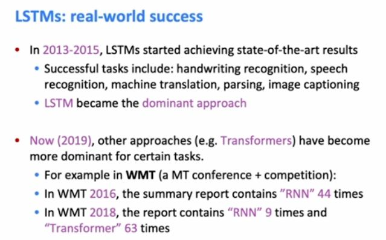
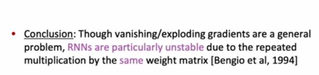

the overall idea is that if the gate is open, that represents some kind of information being passed through, and if the gate is closed, it [NOISE] means that information does not pass through. Okay. So, the last really important thing is that the gates are dynamic. They're not just set at some constant value for the whole sequence. [NOISE] Um, they're dynamic, which means that they're different on each timestep T, and the value that is the decision of whether they're open or closed and in which ways, [NOISE] um, that is computed based on the current context. 

So, on the next line what's happening is that we're going to use the forget gate to selectively forget some of the information from the previous, [NOISE] uh, memory cell. And you can see that we're doing these element-wise products, that's what the little circle is. So, the idea is that if you remember that f_t is a vector full of values between zero and one, when you do an element-wise product between f_t and the previous cell state c_t minus one, then what you're essentially doing is you're kind of masking out some of the information from the previous hidden state. Sorry, no. Previous cell state. So, when f is one, then you're copying over the information, but when f is zero, then you're getting rid of that information, you are erasing it or forgetting it. Okay. And then the other half of this equation, um, i_t times c tilde t, uh, that's the input gate controlling which parts of the new cell contents are gonna get written, written to the, to the cell. Okay. And then the last thing we do is we, uh, pass the cell through a tan h, that's just adding another non-linearity, and then you pass that through the output gates and that gives you [NOISE] the hidden state. So, in LSTMs, we often think of the hidden states as being, uh, like the outputs of the RNN. And the reason for this is that you kind of view the cell states as being this kind of internal memory that's not generally accessible to the outside, but the hidden states are the parts that you're gonna pa- pass on to the next part of the model. So, that's why we view it as kind of like the output of the model. [NOISE] Uh, and this is, yeah, x just to remind the- there is- circles are element-wise products and that's how we apply the gates. 

The question is, why are we applying a tan h on the very last equation on this, on this slide? Why we're planning a tan h to the cell before applying the output gate? Let's see. Um. Yeah. So, your question is, the- the cell, the new cell content already went through a tan h. Um, I'm not sure. So, I suppose a- a- a general answer is that it must be giving some kind of more expressivity in some way, and that it's not just applying tan h's sequentially because you do have the gates in between. Um, so I suppose there must be a reason, kind of similarly to when you apply- apply a linear layer you won't have a non-linearity before the next linear layer. 

So the question is, why is the forget gate computed only for the previous hidden state and the current input, why is it not computed based on ct minus one itself, right? Because surely you want to look at the thing to figure out whether you want to forget it or not? Um, that's a pretty good question. Uh, so, I suppose one reason why you might think that this- this works fine is that the LSTM might be learning a general algorithm for where it stores different types of information in the cell, right? So, maybe it's learning that in this particular position in the cell, I learn information about this particular semantic thing and then in this situation, I want to use that or not use that, forget it or keep it. But, yeah, I haven't entirely convinced myself why you don't want to look at the contents of the cell itself in order to decide. I suppose another thing to notice is that ht minus one was read from ct minus one. So, I suppose there is some information there but not necessarily all of the information. 

Why does the- the logic about, ah, the chain rule kind of getting smaller and smaller or bigger and bigger not apply? So, I think the key here is that, um, in the vanilla RNN, the hidden states are kind of like a bottleneck, right? Like all gradients must pass through them. So, if that gradient is small then, all downstream gradients will be small, whereas here you could regard the cell as being kind of like a shortcut connection at least in the case where the forget gate is set to remember things, um, then that's kind of like a shortcut connection where the cell will stay the same if you have the forget gate set to remember things. So, if the cell is staying mostly the same, then you are not going to be, ah, having the vanishing gradient via the cell. So, that means that to get a connection from the gradient of something in the future with respect to something in the past, there is a potential route for the gradient to go via the cell that doesn't necessarily vanish.

So, the important thing to notice here is that we have this one minus u and u term. So um, it's kind of like a balance right? U is ah is setting the balance between preserving things from the previous hidden state versus writing new stuff. So, whereas in the LSTM, those were two completely separate gates that could be whatever value. Here we have this constraint that U is being uh, balanced. So, if you have more of one, you have to have less of the other. So, this is one way in which the creators of the GRU sought to make LSTMs more simple. Was by having a single gate play both of these roles. 

And one of the reasons why, uh, RNNs don't tend to be nearly as deep as these other kinds of networks, is that because as we commented before, RNNs have to be computed, uh, sequentially; they can't be computed in parallel. This means that they're pretty expensive to compute. If you have this depth in like, two-dimensions, you have the depth over the timesteps and then the depth over the RNN layer is two, then it beco- it becomes very, very expensive to compute these, these RNNs. So, that's another reason why they don't get very deep. 

