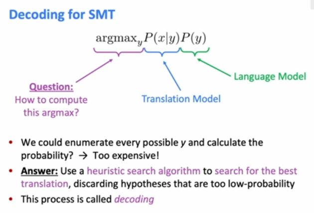
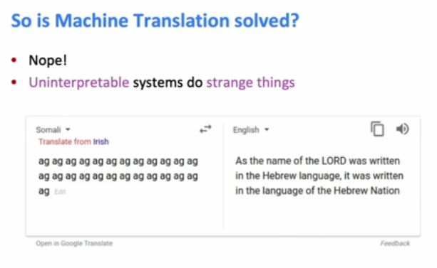

In above image we see what's happens in test time.

So the reason I'm highlighting this is because if you remember in SMT, uh, we didn't directly learn the translation model p of y given x, we broke it down into, uh, uh, smaller components. Whereas here in NMT, we are directly learning this model. And this is in some ways an advantage because it's simpler to do. You don't have to learn all of these different systems and optimize them separately. It's, uh, kind of, simpler and easier. 

Uh, so this is what happens during training. Uh, you feed your source sentence into the encoder RNN, uh, and then you feed your target sentence into the decoder RNN, and you're going to pass over that final hidden state to be the initial hidden state of the decoder. And then, uh, for every step of the decoder RNN, you're going to produce the, uh, probability distribution of what comes next, which is the, the y hats. And then from those, you can compute your loss. And the loss is just the same as we saw for, u h, unconditional language models. It's, uh, the cross entropy or you could also say negative log-likelihood of the true next word. So for example, on those selected ones, uh, the loss is the negative log probability of the correct next word. And then as before, we're going to average all of these losses to get the total loss for the example. 

Uh, so a thing you might notice people saying in, for example, research papers is this phrase end-to-end. And this is an example of learning a system end-to-end. And what we mean by this is that the backpropagation is happening end-to-end, one end is, is losses, the loss functions, and the other end I guess is kind of like the, the beginning of the encoder RNN. The point is that you, uh, backpropagation, uh, flows throughout the entire system, and you learn the entire system with respect to this single, uh, loss. Yep? 

The question is, if the decoder RNN outputs the end token too early, then how can you measure the loss on, uh, the words that came after that? So this is the difference between training time and test time, which is pretty confusing. So, uh, during training, we have this picture where you feed the token back in. So in this scenario, once you produce end, then you have to stop because you can't feed end in as the initial next step. But in training, you don't feed the thing that you produced into the next step. During training, you feed the target sentence from the corpus. So like the gold target sentence into the model. So no matter what the, uh, the decoder predicts on a step, you kind of, you don't use that for anything other than computing loss. 

The question is, is there a reason why you would want to train end-to-end when, for example, you might want to train the encoder and the decoder separately? Uh, so I think, uh, people view training end-to-end as favorable because the idea is that you can optimize the system as a whole. You might think that if you optimize the part separately, then when you put them together, they will not be optimal together necessarily. So if possible, directly optimizing the thing that you care abou- about with respect to all of the parameters is more likely to succeed. However, there is a notion of pre-training. And as you said, maybe you'd want to learn your, um, decoder RNN as a kind of a language model, an unconditional language model by itself. And that's something that people do. You might, uh, learn a very strong language model, and then use that to initialize your decoder RNN, and then fine-tune it on your task. That's a, a valid thing you might try to do. 

So you can think of, uh, K kind of as how big is your search space at any one time. So if you increase K, then you're going to be considering more different options on each step and you might hope that this will mean that you get the best quality solution in the end though of course it'll be more expensive. 

Okay. So, um, here's an example of beam search decoding in action. Uh, so let's suppose the beam size equals K, uh, is 2 and then as a reminder, we have, uh, this is the score that you apply to a partial, uh, hypothesis, uh, a partial translation, which is a hypothesis. So we start off with our starting token, and the idea is that we're going to compute the probability distribution of what word might come next. So having computed that probability distribution using our seq2seq model, then we just take the top K, that is top two possible options. So let's suppose that the top two are the words "He" and "I". So the idea is that we can compute the score of these two hypotheses, uh, by using the formula above. It's just the log probability of this word given the context so far. So here, let's say that "He" has a score of -0.7 and "I" has a score of -0.9. So this means that he is currently the best one. Okay. So what we do is, uh, we have our two, uh, K hypotheses, and then for each of those, we find the top K words that could come next. And we calculate their scores. So this means that for both "He" and "I" we find the top two words that could come next. And for each of these four possibilities, uh, the score of the hypothesis is equal to, uh, the log probability of this new word given the context so far plus the score so far because you can accumulate the sum of low probabilities. You don't have to compute it from scratch each time. So here you can see that we have these four possibilities and that the top two scores are -1.6 and -1.7. So this means that hit and was are the two best ones. So the idea is that of these K squared equals 4 hypotheses, we're just gonna keep the K equals 2 top ones. And then we just keep doing the same thing. For these two, we expand to get the two next ones. And then of those we compute the scores, and then we keep the two best ones and discard the others and then of those, we expand. So we keep doing this again and again, expanding and then just keeping the top K and expanding like this until, uh, you get some kinda, uh, finished translation. I'm going to tell you more in a moment about what exactly the stopping criterion is. But let's suppose that we stop here. Uh, looking at the four hypotheses that we have on the far right, the one with the top score is, uh, the top pie one with -4.3. So let's suppose that we are gonna stop now when we decide that this is the top hypothesis, then all we need to do is just backtrack through this tree in order to find the full translation, which is "He hit me with the pie." 

If we have our sets of hypotheses, and then we're choosing the top one based on the one that has the best score, can anyone see a problem? Yeah. [NOISE] So the answer was you're gonna end up choosing the shortest one. The problem here is that longer hypotheses have lower scores in general because you're multiplying more probabilities so you're getting a smaller, a smaller overall value or I guess if we're adding low probabilities we're gonna get more negative values. So it's not quite that you will definitely choose the shortest hypothesis because if you could overall have, uh, a lower score but there's definitely going to be a bias towards shorter translations, uh, because they'll in general have lower scores. So the way you can fix this is pretty simple, you just normalize by length. So instead of using the tools we have above, you're going to use, uh, the score divided by [inaudible]. And then you use this to select the top one. 

So when I say n-gram precision, I mean you're gonna look at all the one, two, three, and four grams that appear in your, uh, machine written translation and your human written translation. And then n-gram precision is basically saying, for all of the n-grams that appeared in the machine-written translation, how many of those appeared in, you know, at least one of the human-written translations? Another thing that you need to add to BLEU is a brevity penalty. Uh, so you're saying that you get a lower BLEU score if your system translation is significantly shorter than all of the human-written translations. And the reason why you need to add this is because n-gram precision alone doesn't [NOISE] really punish using, uh, fewer words. So you might try to maximize n-gram precision by being very conservative and writing, uh, short sentences that only contain words that you're really sure about, and then you get a good precision score. But this doesn't make a good translation because you're probably missing a bunch of information that you needed to translate from the source sentence. So that's why you need to add the brevity, uh, penalty. 

So what's going on here is that, um, often for low resource languages, such as for example Somali, um, one of the best resources of parallel text is the Bible. So you train for example Somali to English using the Bible as a training text, maybe among other texts. Okay, that's the first puzzle piece. But the other puzzle piece is the nonsensical input. So when the input isn't really Somali or any kind of text, right? It's just the same syllable over and over. Then the NMT system doesn't really have anything sensible to condition on. Its basically nonsense, it's just noise. So what does the NMT system do? Right? It can't really use, it can't really condition on the source sentence. So what it does, is it just uses the English language model, right? You can think of it as like the English language model of the decoder RNN just kind of goes into autopilot and starts generating random text, kind of like we saw last week when we saw, uh, a language model trained on Obama's speeches or Harry Potter would just generate texts in that style. That's kind of what's happening here with the Bible, because we don't have any useful information, um, from the sentence on the left. 

Right. I think these are different ways of saying a similar idea [NOISE] which is that we have a kind of informational bottleneck. Uh, we're forcing all of the information about the source sentence to be captured in this single vector because that's the only thing that gets given to the decoder. If some information about source sentence isn't in our vector, then there's no way the decoder is gonna be able to translate it correctly. So this is the, yeah, this is an informational bottleneck. [NOISE] It's putting kind of too much pressure on this single vector to be a good representation [NOISE] of the encoder. So this is the motivation for attention. Attention is a neural technique and it provides a solution to the bottleneck problem. 

