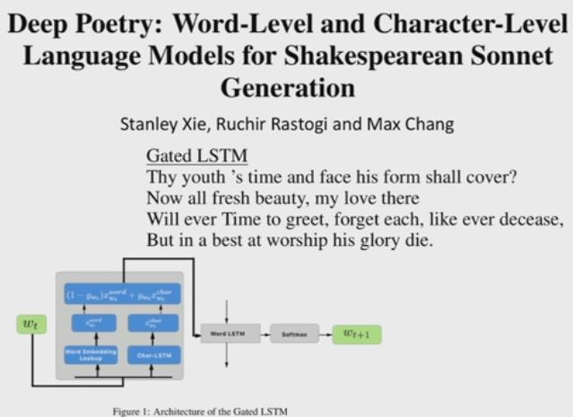
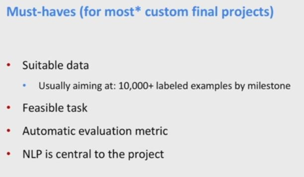

And so an idea of how you could fix that is to say well, suppose we just put in direct connections that were longer distance, um, then we'd also get direct backpropagation signal and so then we wouldn't have this same problem of vanishing gradients. And effectively, we've sort of looked at two ways in which you can achieve that effect. Because one way of you can achieve that effect which Abby looked at in the end part of the last lecture was this idea of attention. So, when you've got attention, you're actually are creating these shortcut connections, oops, they're the blue ones, um, from every time step and using it to calculate an attention distribution. But the way the attention was done that we looked at, it was sort of mushing together all previous time steps into some kind of an average. But the idea of the gated recurrent units is in some sense we want to achieve this same kind of ability to have shortcut connections.  But we want to do it in a more controlled and adaptive fashion where we still do remember the position of things. 

