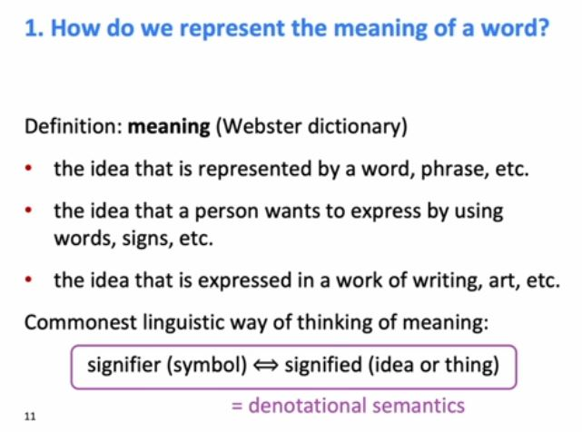

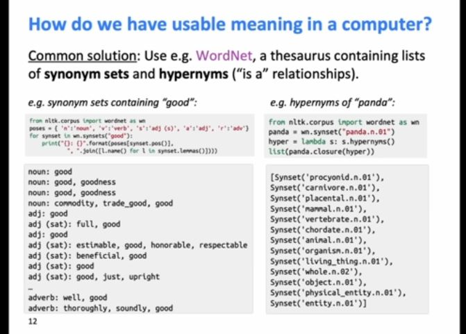

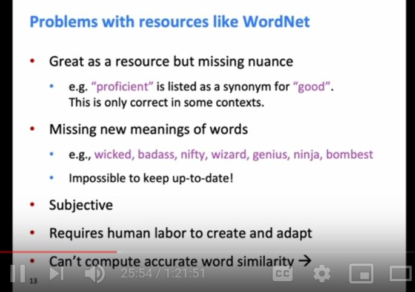

Traditional NLP -> upto 2012

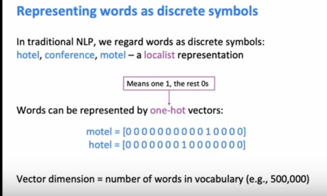

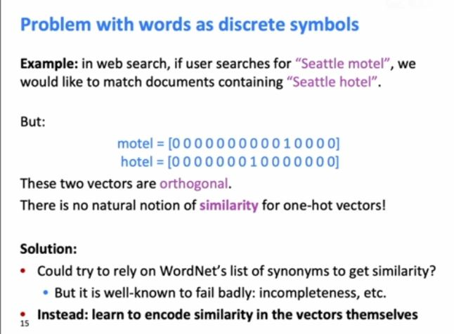

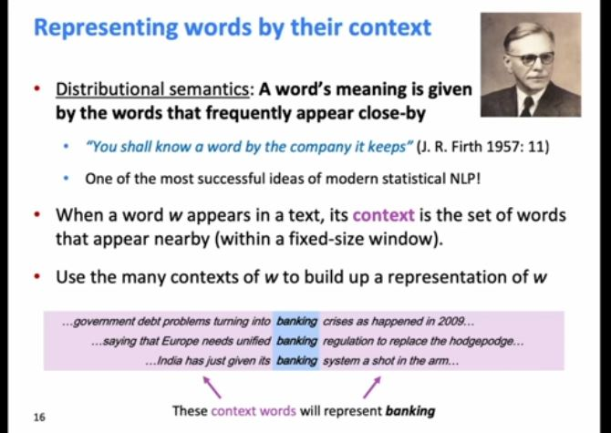

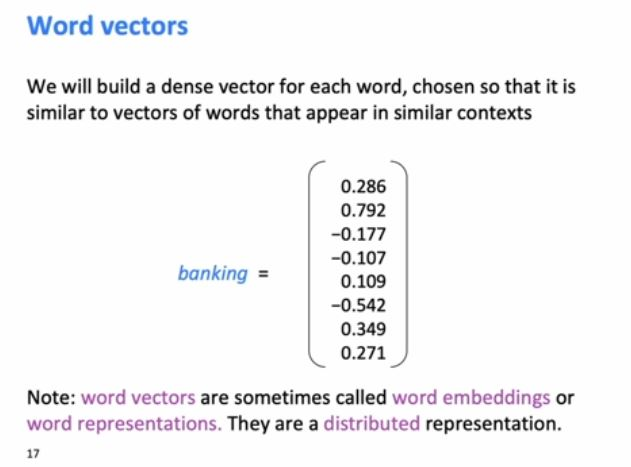

We can place all words in a vector space

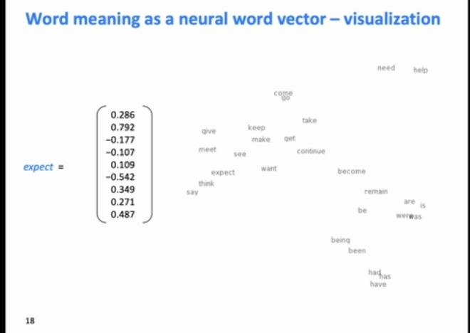

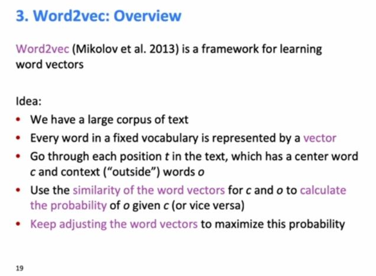

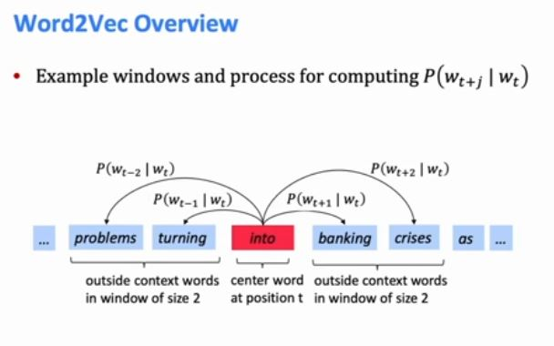

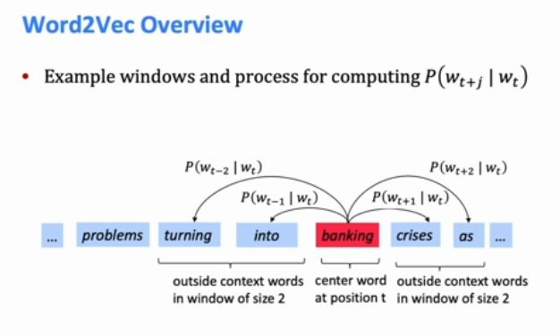

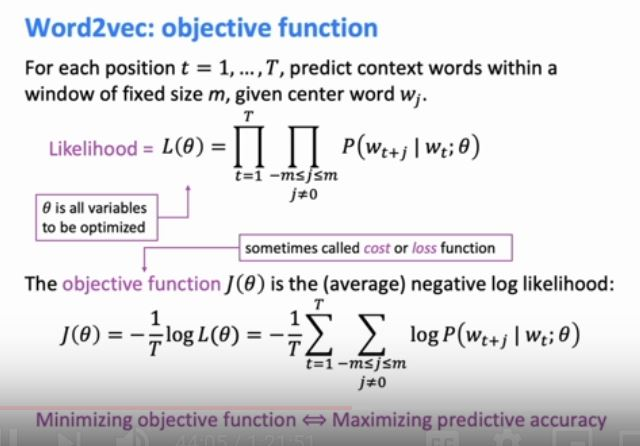

 Okay. So overall, we have a big long corpus of capital T words.
44:12
So if we have a whole lot of documents we just concatenate them all together and we say,
44:17
okay, here's a billion words,
44:19
and so big long list of words.
44:21
And so what we're gonna do,
44:23
is for the first um product we're going to sort of
44:26
go through all the words and then for the second product,
44:30
we're gonna say- we're gonna choose some fixed size window, you know,
44:34
it might be five words on each side or something and we're going to try and
44:37
predict the 10 words that are around that center word.
44:42
And we're going to predict in the sense of trying to
44:44
predict that word given the center word.
44:46
That's our probability model.
44:48
And so if we multiply all those things together,
44:51
that's our model likelihood is how good a job it
44:54
does at predicting the words around every word.
44:58
And that model likelihood is going to depend
45:01
on the parameters of our model which we write as theta.
45:05
And in this particular model,
45:07
the only parameters in it is actually
45:10
going to be the vector representations we give the words.
45:13
The model has absolutely no other parameters to it.
45:16
So, we're just going to say we're representing
45:20
a word with a vector in a vector space and that
45:23
representation of it is its meaning and we're then going to be able to
45:27
use that to predict what other words occur in a way I'm about to show you.
45:32
Okay. So, um, that's our likelihood and so what we do in all of
45:37
these models is we sort of define an objective function and then we're going to be,
45:42
I want to come up with vector representations of words in
45:45
such a way as to minimize our objective function.
45:50
Um, so objective function is basically the same as what's on the top half of the slide,
45:56
but we change a couple of things.
45:58
We stick a minus sign in front of it so we can do minimization rather than maximization.
46:03
Completely arbitrary makes no difference.
46:05
Um, we stick a one and T in front of it,
46:08
so that we're working out the sort of average
46:11
as of a goodness of predicting for each choice of center word.
46:16
Again, that sort of makes no difference but it kinda keeps the scale of
46:19
things ah not dependent on the size of the corpus.
46:23
Um, the bit that's actually important is we stick a log in front of
46:27
the function that was up there um because it turns out that everything always gets nice.
46:31
So when you stick logs and find the products
46:33
um when you're doing things like optimization.
46:36
So, when we do that we then got a log of
46:38
all these products which will allow us to turn things you know,
46:42
into a sums of the log of this probability 

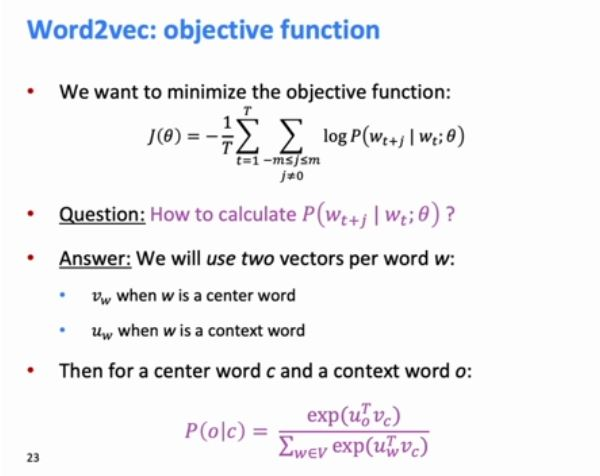

 Since we actually propose two vector representations for
47:42
each word and this makes it simpler to do this.
47:46
Um, you cannot do this,
47:48
there are ways to get around it but this is the simplest way to do it.
47:50
So we have one vector for word when it's the center word that's predicting
47:54
other words but we have a second vector for each word when it's a context word,
47:59
so that's one of the words in context.
48:01
So for each word type,
48:02
we have these two vectors as center word, as context word. 

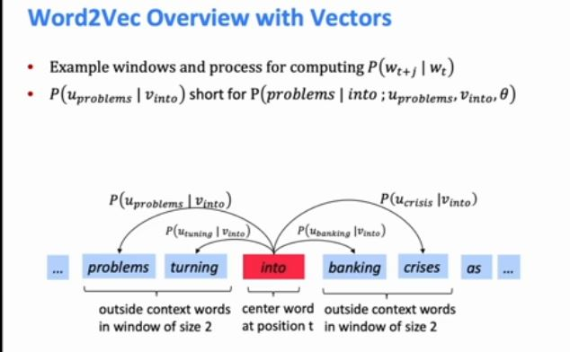

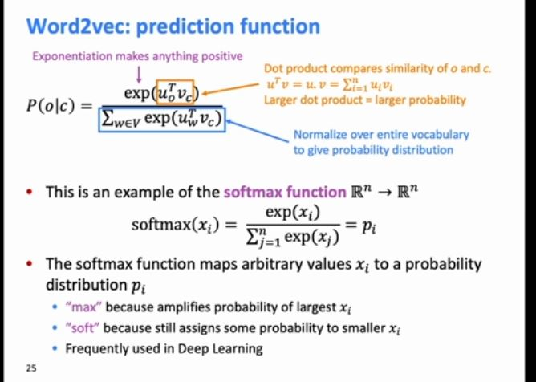

 So for the very center bit of it,
49:12
the bit in orange are more the same thing occurs in the um, denominator.
49:17
What we're doing there is calculating a dot product.
49:21
So, we're gonna go through the components of our vector and we're gonna
49:24
multiply them together and that means if um,
49:28
different words have B components of the same sign,
49:32
plus or minus, in the same positions,
49:35
the dot product will be big and if
49:38
they have different signs or one is big and one is small,
49:42
the dot product will be a lot smaller.
49:44
So that orange part directly calculates uh,
49:48
sort of a similarity between words where
49:51
the similarity is the sort of vectors looking the same, right?
49:55
Um, and so that's the heart of it, right?
49:57
So we're gonna have words that have similar vectors,
50:00
IS close together in the vector space have similar meaning.
50:04
Um, so for the rest of it- um,
50:06
so the next thing we do is take that number and put an X around it.
50:10
So, um, the exponential has
50:12
this nice property that no matter what number you stick into it,
50:15
because the dot product might be positive or negative,
50:17
it's gonna come out as a positive number and if
50:20
we eventually wanna get a probability, um, that's really good.
50:24
If we have positive numbers and not negative numbers, um, so that's good.
50:28
Um, then the third part of which is the bid in blue is we wanted to have
50:33
probabilities and probabilities are meant to add up to
50:36
one and so we do that in the standard, dumbest possible way.
50:39
We sum up what this quantity is,
50:42
that every different word in our vocabulary and we divide through by
50:47
it and so that normalizes things and turns them into a probability distribution. 

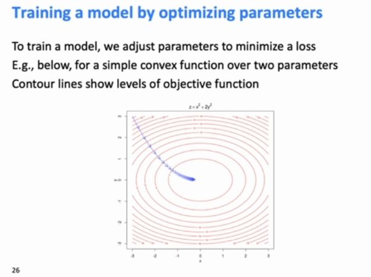

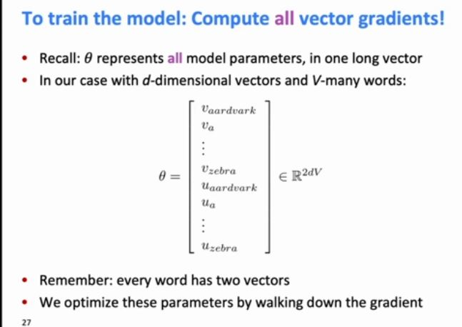