Traditional NLP -> upto 2012

We can place all words in a vector space

Okay. So overall, we have a big long corpus of capital T words. So if we have a whole lot of documents we just concatenate them all together and we say, okay, here's a billion words, and so big long list of words. And so what we're gonna do, is for the first um product we're going to sort of go through all the words and then for the second product, we're gonna say- we're gonna choose some fixed size window, you know, it might be five words on each side or something and we're going to try and predict the 10 words that are around that center word. And we're going to predict in the sense of trying to predict that word given the center word. That's our probability model. And so if we multiply all those things together, that's our model likelihood is how good a job it does at predicting the words around every word. And that model likelihood is going to depend on the parameters of our model which we write as theta. And in this particular model, the only parameters in it is actually going to be the vector representations we give the words. The model has absolutely no other parameters to it. So, we're just going to say we're representing a word with a vector in a vector space and that representation of it is its meaning and we're then going to be able to use that to predict what other words occur in a way I'm about to show you. Okay. So, um, that's our likelihood and so what we do in all of these models is we sort of define an objective function and then we're going to be, I want to come up with vector representations of words in such a way as to minimize our objective function. Um, so objective function is basically the same as what's on the top half of the slide, but we change a couple of things. We stick a minus sign in front of it so we can do minimization rather than maximization. Completely arbitrary makes no difference. Um, we stick a one and T in front of it, so that we're working out the sort of average as of a goodness of predicting for each choice of center word. Again, that sort of makes no difference but it kinda keeps the scale of things ah not dependent on the size of the corpus. Um, the bit that's actually important is we stick a log in front of the function that was up there um because it turns out that everything always gets nice. So when you stick logs and find the products um when you're doing things like optimization. So, when we do that we then got a log of all these products which will allow us to turn things you know, into a sums of the log of this probability 

Since we actually propose two vector representations for each word and this makes it simpler to do this. Um, you cannot do this, there are ways to get around it but this is the simplest way to do it. So we have one vector for word when it's the center word that's predicting other words but we have a second vector for each word when it's a context word, so that's one of the words in context. So for each word type, we have these two vectors as center word, as context word. 

So for the very center bit of it, the bit in orange are more the same thing occurs in the um, denominator. What we're doing there is calculating a dot product. So, we're gonna go through the components of our vector and we're gonna multiply them together and that means if um, different words have B components of the same sign, plus or minus, in the same positions, the dot product will be big and if they have different signs or one is big and one is small, the dot product will be a lot smaller. So that orange part directly calculates uh, sort of a similarity between words where the similarity is the sort of vectors looking the same, right? Um, and so that's the heart of it, right? So we're gonna have words that have similar vectors, IS close together in the vector space have similar meaning. Um, so for the rest of it- um, so the next thing we do is take that number and put an X around it. So, um, the exponential has this nice property that no matter what number you stick into it, because the dot product might be positive or negative, it's gonna come out as a positive number and if we eventually wanna get a probability, um, that's really good. If we have positive numbers and not negative numbers, um, so that's good. Um, then the third part of which is the bid in blue is we wanted to have probabilities and probabilities are meant to add up to one and so we do that in the standard, dumbest possible way. We sum up what this quantity is, that every different word in our vocabulary and we divide through by it and so that normalizes things and turns them into a probability distribution. 

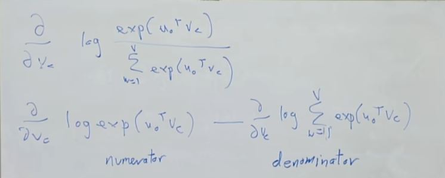

log and exponent cancel out

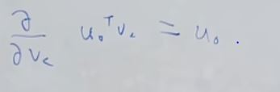

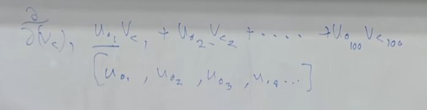

vc1 is not on all term so we get u1 only

For the second part we apply chain rule

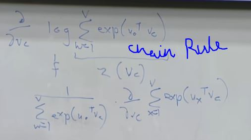

Inserting the derivetive term inside the summation term 

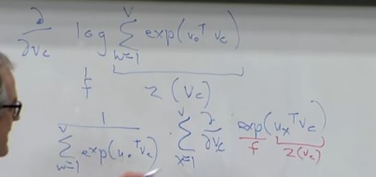

Applying chain rule again

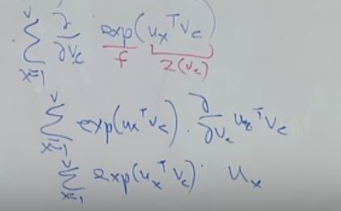

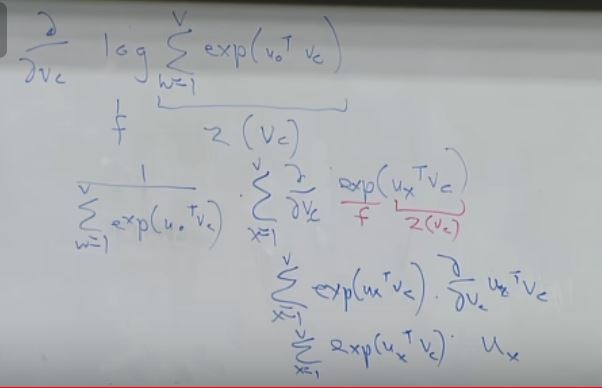

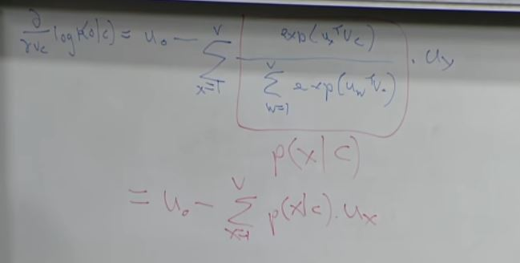

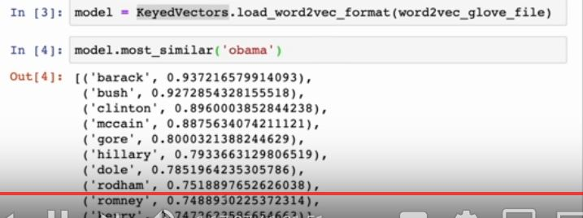

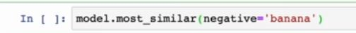

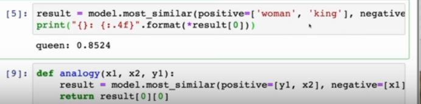