We're gonna subtract the man vector from the king vector and the idea we have in our head then is if we do that what will happen is we'll be left with the meaning of kingship without the manness. Um, and so then there's also a direct vector for a woman. So, we can add the woman vector to that resulting vector and then we could say well, in the vector, we end up at some point in the vector space and then we're gonna say well, what's the closest word that you're gonna find the here and it's gonna print out the closest word and as we saw.

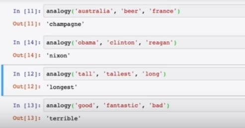

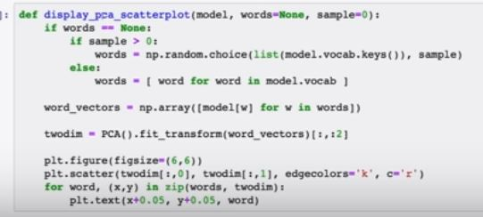

See Code from website

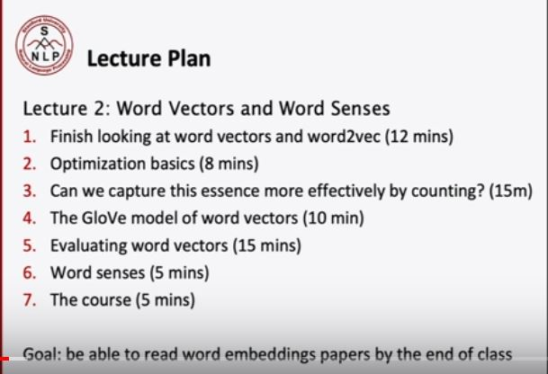

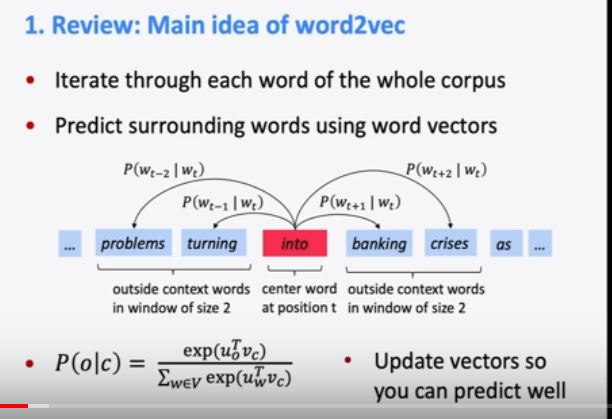

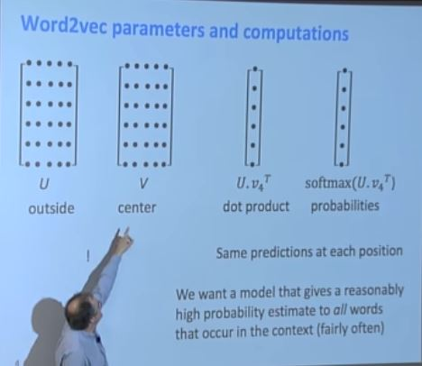

center vector for a word is the 1d vector 

um, well, wait a minute, there was like that and-and, and-of that occur all the time. Um, so that means every word must have a high dot product with words like that and of and, um, they get their probabilities right. And the first answer to that is, "Yup, that's true." And it turns out that all word vectors, [NOISE] um, have a very strong prob- word probability component that reflects that. And I mean, one of the things that some workers discuss, so on the readings, there are two papers from Sanjeev Arora's group in Princeton and one of those papers sort of discusses, um, this probability, high frequency effect and your crude way of [NOISE] actually fixing this high frequency effect is that normally, um, the first, um, the first biggest component in your word vectors is actually a frequency effect and if you just lop it off, you can make your semantic similarities better. Um, but there are other things that we do to sort of deal with high frequencies. 

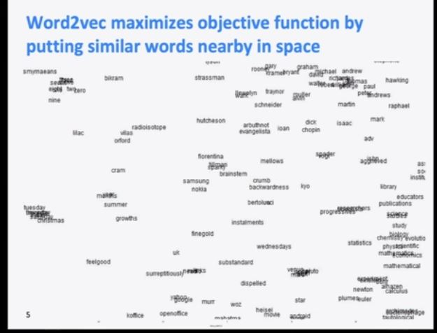

um, we show all these two-dimensional pictures. They're exceedingly, exceedingly misleading because in these pic, two-dimensional pictures, you know, you have these effects that if, you know, Samsung is close to Nokia, it has to be over here and then it has to be far away from words that are over here. Um, whereas you might sort of also want to have the effect that Nokia is close to Finland for a different reason, um, and you can't do that in two-dimensional, um, vector spaces but, you know, one of the, um, most of the properties of high dimensional vector spaces are very unintuitive, and one of the ways that they're unintuitive is in a high dimensional vector space, a word can be close to lots of other words in different directions. 

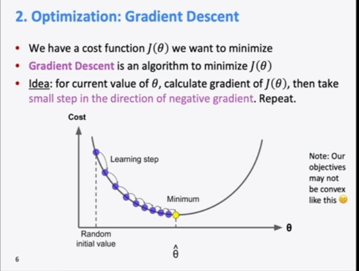

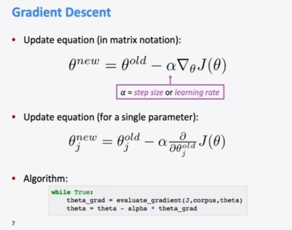

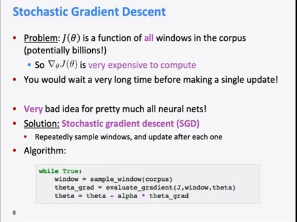

Um, so what people- everyone does is use stochastic gradient descent and in stochastic gradient descent, we sample our window in the simplest case. We, just for this one window, work out an estimate of the gradient and we use it as a parameter update. So, this is sort of an amazingly, amazingly noisy estimate of the gradient but it sort of doesn't matter too much because as soon as we've done it, we're going to choose a different center word and do it again and again, so that gradually we sort of approach what we would have gotten if we'd sort of looked at all of the center words before we took any steps, but because we take steps as we go, we get to the minimum of the function orders and magnitude more quickly. So thi- this shows the simplest case where we're just sampling one window. In practice, that's not what we normally do. We normally sample as- a small bunch, you know, order of approximately 32 or 64. Um, so if we have a sample that's bigger, that's generally referred to as a mini-batch and we calculate a gradient estimate from the mini-batch. Um, so that has two advantages. One advantage is that you kind of get less noisy estimates of the gradient because you've kind of averaged over a bunch of examples rather than just using one, but the second advantage, which is the one why we really care, is if we want our computations to go fast when we're using a GPU, that you need to get parallelization of doing the same operation a whole bunch of times and then you gain a lot by using a mini-batch of 64 examples or something like that. Um, and you don't have to but you know, it turns out the details of the guts of the hardware that you know, it isn't- GPUs, you know, they have these, whatever they have inside them, there in powers of two. So, you get better speedups if you use batches like 32 or 64, rather than just deciding that 42 is still your favorite number from high school and you're going to use that as the size of your mini-batch. 

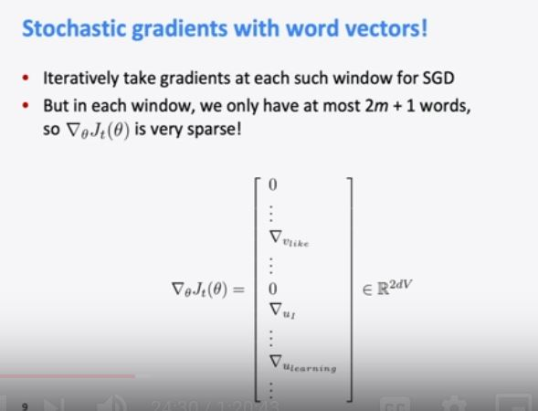

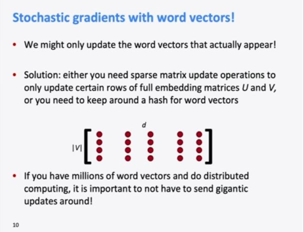

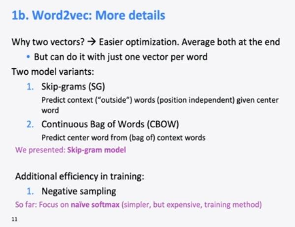

Right. So, a couple of people asked afterwards, yeah, why are there these two word vectors that sort of center and the outside one? And, I mean the answer to that is, it makes that math I showed you easy, right? So that if, um, if you do it as I showed you, well, you know, for working out, um, the partial derivatives for the center word. It's just as I showed you, it's easy. Um, but if you use only one set of word vectors, well then the same word, that's the center word, will be one of the choices for the context word when you're working out that Softmax for the context word. And then you'll get these terms that are then squared terms in terms of the two references, so that same word, and that makes your math more difficult. Um, so it's sort of just a practical thing, um, in the end. I mean it sort of doesn't make very much difference, because if you sort of think about it since you're going along through all the, um, positions, you know. What was a center word at one point is immediately afterwards a context word of what used to be a context word, which is now the center word. So, sort of doing the same computations because, you know, the dot product is symmetric actually, um, all over again. So, they get pretty similar vector representations. So, it seems like in general you can get the best results by averaging what comes out for your two vectors, and you end up with just one vector per word. 

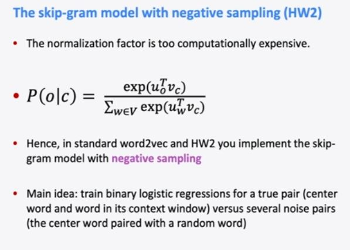

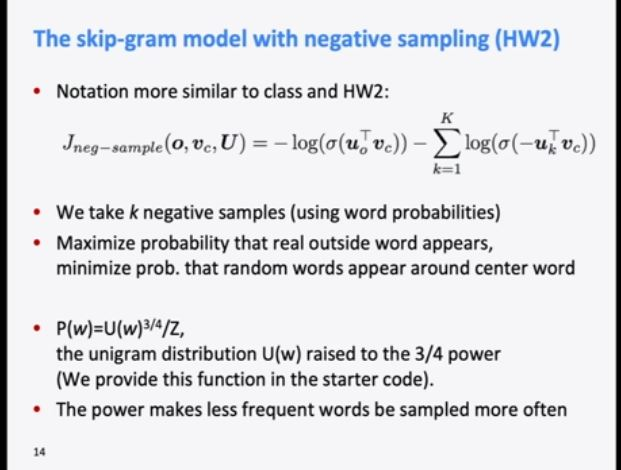

And so, we're going to train one binary logistic regression for the actual word observed what's in the numerator, and you want to give high probability to the word that was actually observed. And then, what we're going to do, is we're going to sort of randomly sample a bunch of other words, they're the negative samples and say they weren't the ones that were actually seen. So, you should be trying to give them as low a probability as possible. 

And we've got two terms, the first one, um, is the log of the sigmoid of the observed context word, the outside words, dot producted with the center word, and we're going to want that to be big. Um, and then on the other hand, um, we've got, um, the, um, randomly chosen K words, which are just other words, and we're going to work out dot products between them and the center word. And we're going to want those to be as small as possible. Um, note that extra minus sign in there which is causing the sign of the two things to be different, right? So, those are our negative samples. And for big K, it can be a reasonably modest number, you can just take kind of 10, 15 negative samples and that works pretty fine. Um, I said we sort of sampled some words, um, to be the negative samples. They in particular propose a sampling distribution that helps them along a little in partly dealing with this pro- problem of very frequent words. Um, so the starting point of how you sample words is you use what we call the- the unigram distribution. So, that just means you take words on a large corpus and count up how often each one occurs just as a count of independent words, so there's the called unigram counts. And so you start off with unigram counts, but then you raise them to the three quarters power. And raising to the three quarters power, has the effect of, um, decreasing how often you sample very common words, and increasing how often you sample rarer words. 

Z is normalising term so we can make a probability distribution.

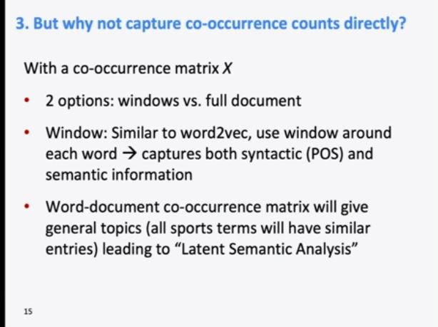

Look we have this whole big pile of data you know,
39:12
sort of traditional, I'm thinking of statistics, right?
39:16
So you have a big pile of data,
39:18
you aggregate it and it sort of seems like there are obvious things you could do here.
39:22
You could say, well there's a word like,
39:24
whatever word we're using, banana.
39:27
Let's just see what words occur in the context of the gut banana and count
39:31
them all up and then we'll be able to use those to predict somehow and you know,
39:35
those kinds of methods were traditionally
39:38
used including even with distributed representation techniques. 

Traditional NLP : Just use frequency

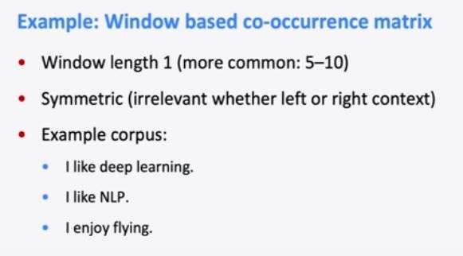

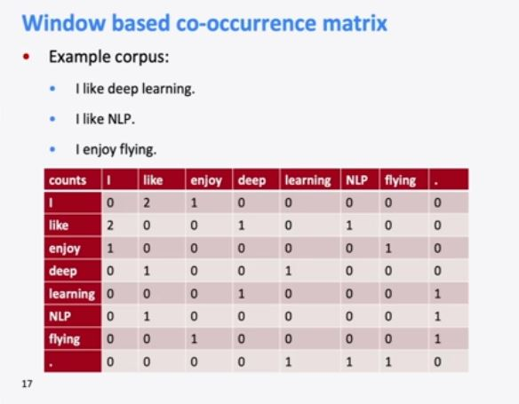

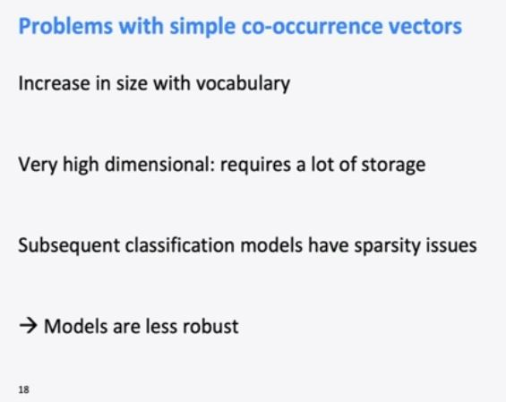

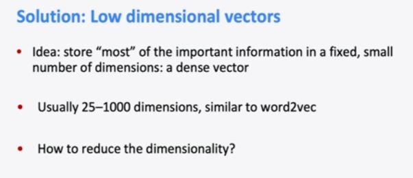

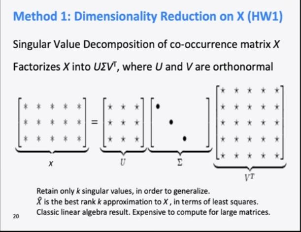

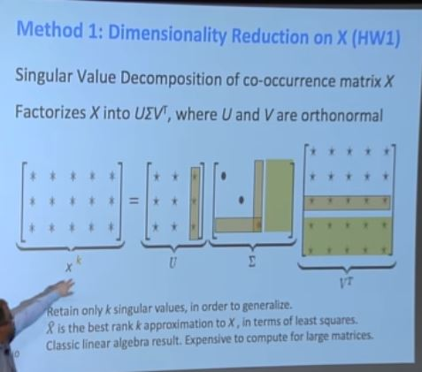

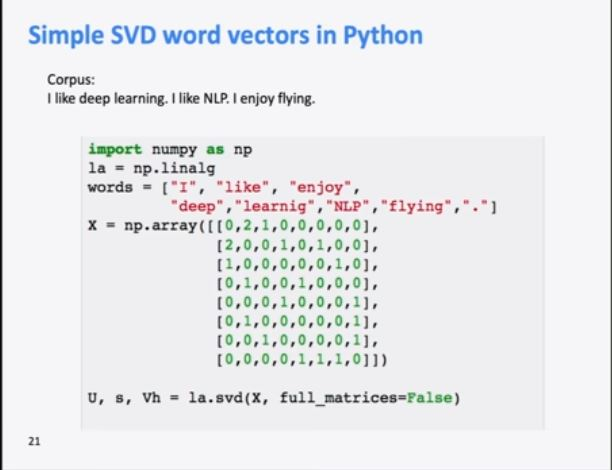

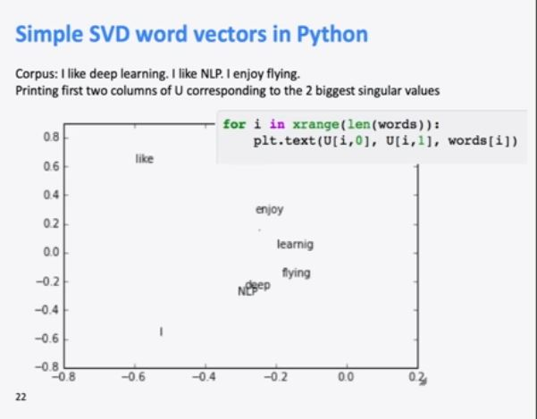

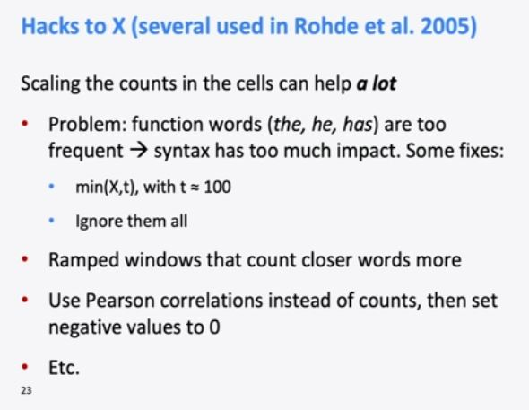

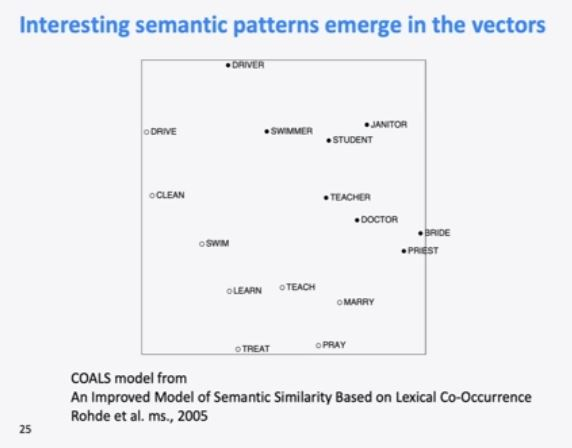

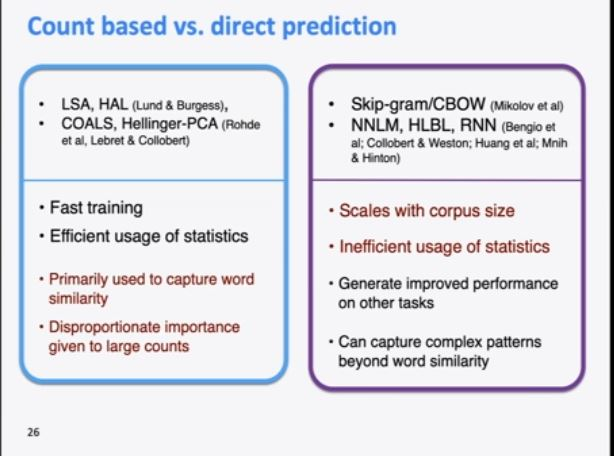

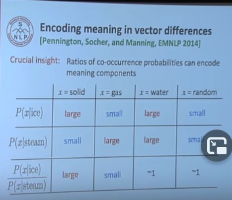

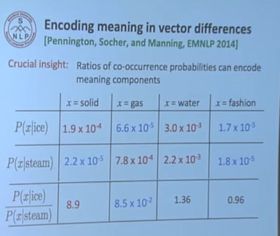

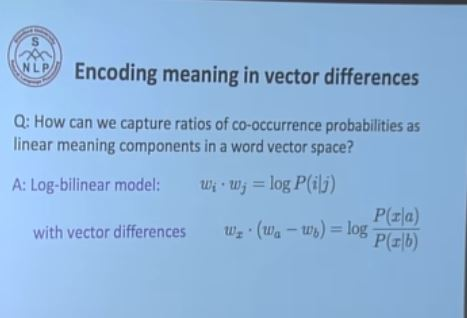

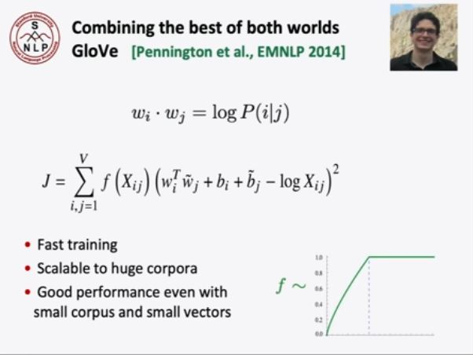

But essentially we've got this squared loss here and then we wanting to say the dot-product should be as similar as possible to the log of co-occurrence probability and so you'll they'll be lost to the extent that they're not the same, but we kind of complexify it a little by putting in bias terms for both of the two words. Because maybe the word is just overall common and likes to co-occur things or uncommon or does end. And then we do one more little trick because every does tricks to make the performance better is that we also use this f-function in front, so that we're sort of capping the effect that very common word pairs can have on the performance of the system. 

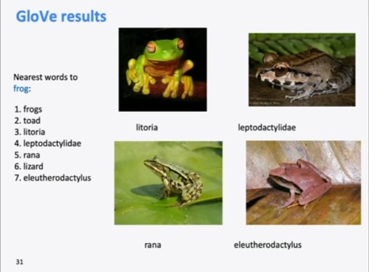

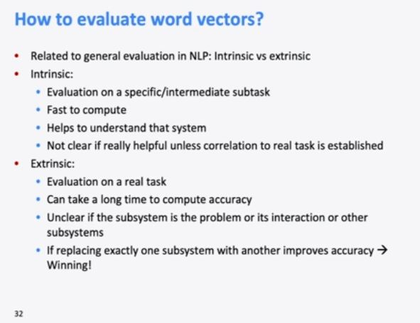

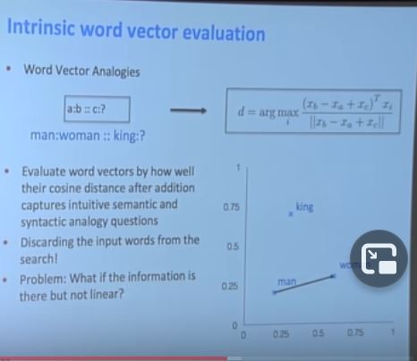

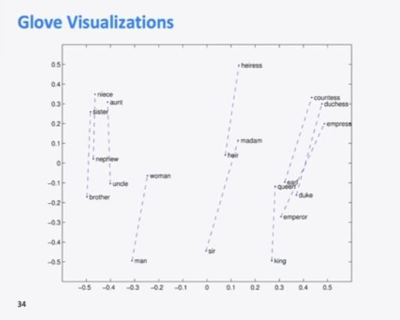

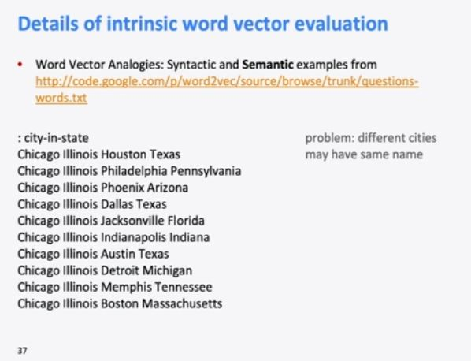

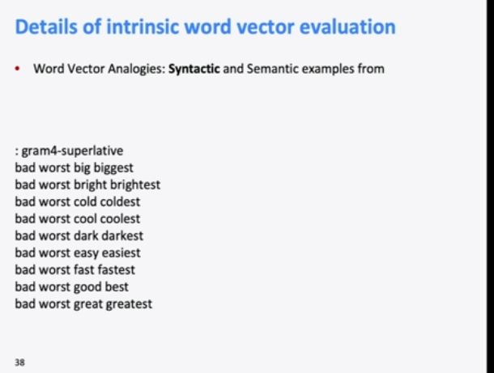

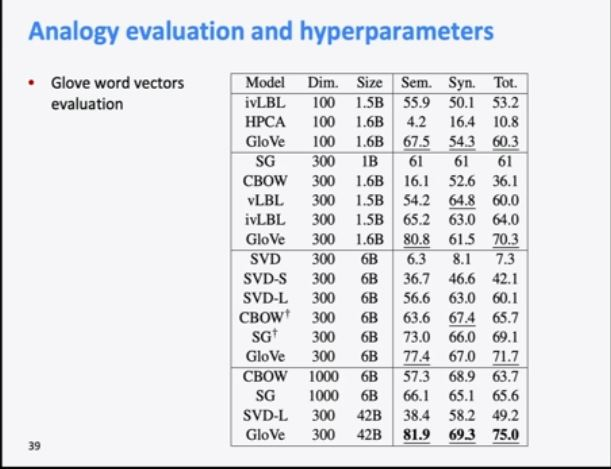

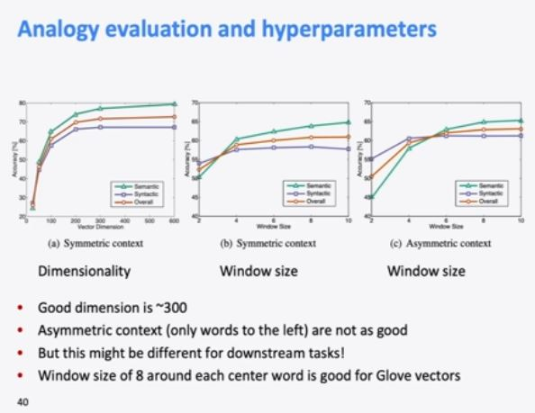

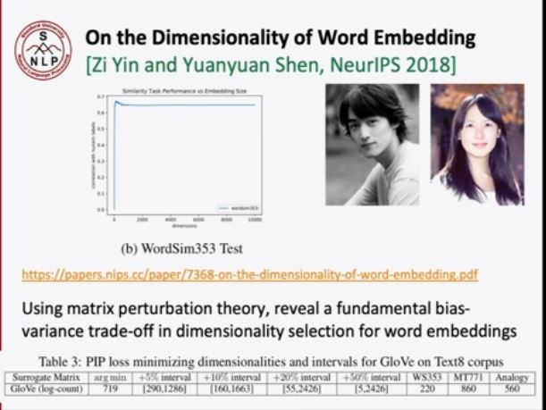

And so the interesting result that they show is, that things don't fall apart. Um, and that you can essentially go out to these huge huge dimensionalities, and the performance stays flat. And that they've got a lot of theory, sort of for predicting why that that's actually going to end up being the case. 

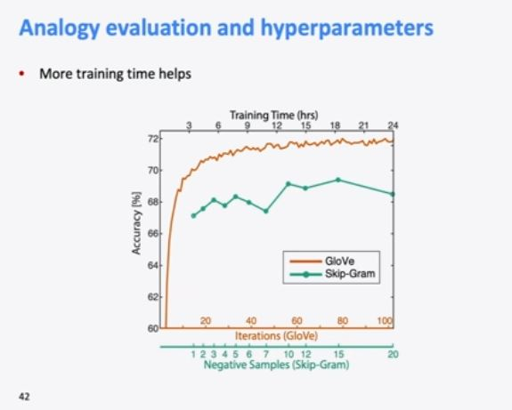

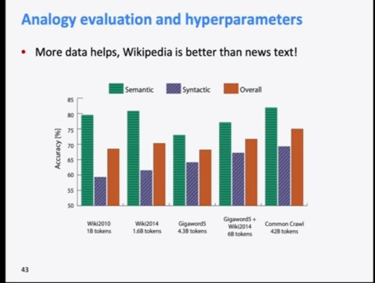

So that you actually find that 1.6 billion tokens of Wikipedia works better than 4.3 billion tokens of News-wire newspaper article data. And so I, I think that's sort of actually make sense, which is well, you know, the job of encyclopedias is to just sort of explain concepts and how they relate to each other, right? So that encyclopedias are just much more expository text that show all the connections between things, whereas newspapers in general aren't trying to expose at how things fit together. They're just telling you about, you know, who got shot dead last night or something like that, right? 

So, um, so this is sort of interesting fact, um, that this Wikipedia data kind of really, it sort of is differentially useful, um, for, um, making word vectors. 

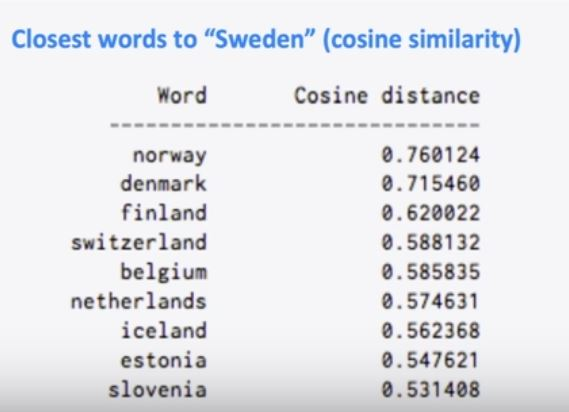

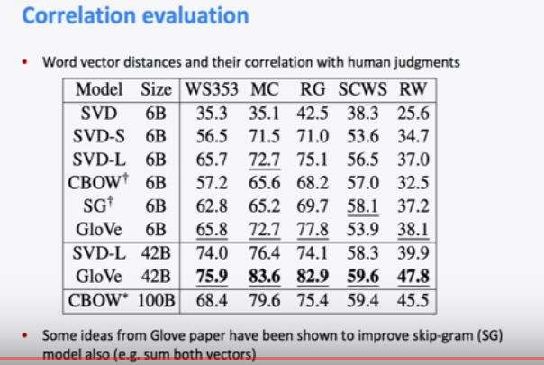

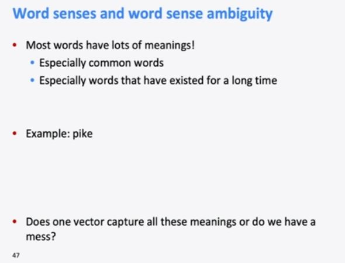

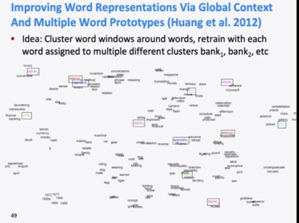

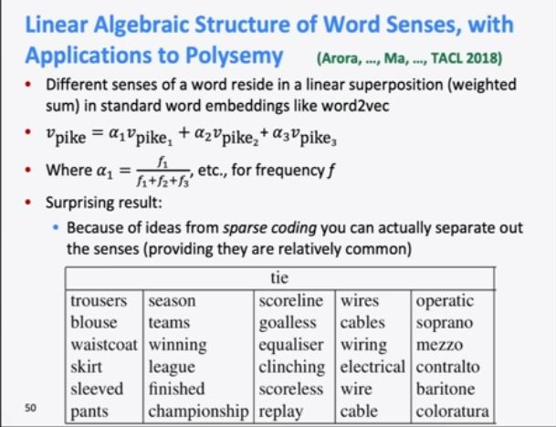

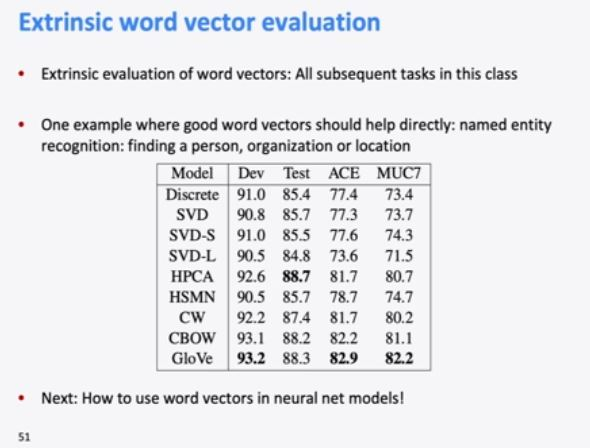