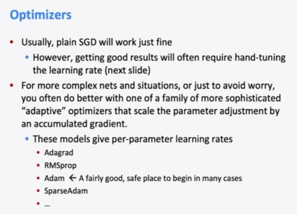

One way to do backprop is think element wise and then come to matrix.

Is like we have three W and what's the derivative of three W with respect to W? It's three, right? So, that we've have a term here which is what would have been W, will be WIJ times XJ, and its derivative with respect to WIJ is just XJ. 

The update function doesn't always works

Well, suppose that we're training a classifier. Um, you know it could be the one I just did or a softmax or logistic regression. And we wanting to classify um, movie reviews sentiment for positive or negative. Well, you know if we have trained our word vectors, we've got some word vector space and maybe in the word vector space, um, TV, telly and television are all very close together because they mean basically the same thing. So, that's great, our word vectors are good. But, well suppose it was the case, that in our training data for our classifier. So, this is our training data for movie sentiment review. We had the word TV and telly but we didn't have the word television. Well, then what's going to happen, is well while we try and train our sentiment classifier, if we push gradient back down into the word vectors what's likely to happen is that it will move around the word vectors of the words we saw in the training data. But, necessarily television's not moving, right? Because we're only pushing gradient down to words that are in our training data. So, this word goes nowhere, so it just stays where it was all along. So, if the result of our training is words get moved around. So, here a good words for indicating negative sentiment, um, will actually if at test time, when we're running our model, if we evaluate on a sentence with television in it, it's actually going to give the wrong answer. Whereas if we haven't changed the word vectors at all and had just left them where our word embedding learning system put them. Then it would have said television, that's a word that means about the same as TV or telly. I should treat it the same and my sentiment classifier and it would actually do a better job. So, it's sort of two-sided whether you gain by training word vectors. 

Word2Vec -> already trained word vector model.

## Forward Propagation

## Backward Propagation

There are two arcs that started from the y both of which we've backed complicated some gradient on. And so what do we do about that. Um, what we do about that is we sum. So, the partial of f by x is to the partial of f by z is 0 that the partial of f by y is the sum of the two and five, right? And so this isn't complete voodoo. This is something that should make sense in terms of what gradients are, right? So, that what we're saying, is what we're calculating, is if you wiggle x a little bit how big an effect does that have on the outcome of the whole thing? And so, you know, we should be able to work this out. So, our x started offers one but let's suppose we wiggle it up a bit and make it 1.1 well according to this output should change by about 0.2, it should be magnified by two. And we should be able to work that out, right? So it's then 1.1 plus two, so that's then 3.1. And then we've got the two here that multiplies by it and it's 6.2. And lo and behold it went up by 0.2, right? So that seems correct. And if we try and do the same for, well, let's do the z. It's easy. So if we wiggle the z which had a value of zero by 0.1. This is 0.1. When we max if this is still two and so a calculated value doesn't change, it's still six. So the gradient here is zero. Wiggling this does nothing. And then the final one is y. So, it's starting off value as two. So, if we wiggle it a little and make it 2.1, our claim is that the results are change by about 0.5. It should be multiplied by five times. So, if we make this 2.1 we then have 2.1 plus one and b 3.1. When we get the max here would also be 2.1. And so we'd have 2.1 times 3.1. And that's too hard arithmetic for me to do in my head. But if we take 2.1 times 3.1 it comes out to 6.51. So, basically it's gone up by half. 

But you know, one of the bad things about using um transcendental functions like the sigmoid or tanh is, you know, they involve this expensive math operations um that slow you down. Like, it's sort of a nuisance to be kind of computing exponentials and tanh's in your computer, things are kind of slow. 

So people cam up with hard tanh

So after hard tanh worked people came up with ReLU

Its hard to believe relu works but it works perfectly.

it is, it is simply just each u-, depending on the inputs, each unit is just either dead or it's passing things on as an identity function. But that's enough of lini-, non-linearity that you can do arbitrary function approximation still with a deep learning network. 

maybe we could actually put another parameter into our neural network and we could have a parametric ReLU. So, there's some slope over here but we're also going to backpropagate into our non-linearity which has this extra alpha parameter, which is how ma- much slope it has. 

So, if you just start off with the weights being zero, you kind of have these complete symmetries, right, that everything will be calculated the same, everything will move the same and you're not actually training this complex network with a lot of units that are specializing to learn different things. So, somehow, you have to break the symmetry and we do that by giving small random weights. 

